# Thinkful Data Science Bootcamp
# Final Capstone

#### Emile Badran - 20/September/2018

## Introduction

In this capstone project, I process tweets from the leading Democratic (Hillary Clinton) and Republican (Donald Trump) candidates and key 2016 US election hashtags. I apply Natural Language Processing and Network Analysis techniques to find the key topics, and the most influential actors that have guided the public debate. The project aims to uncover:

- Which topics/hashtags had the most repercussion (measured in the number of comments and re-tweets) among followers of said candidates?
- What key messages can be extracted from the presidential elections public debate?
- How tightly knit were each presidential candidate’s networks?
- Who were the most influential Twitter users in the debate?

Twitter has become a major source of information and a platform for political dialogue for a considerable number of people in the US and elsewhere. By finding the most relevant topics and actors, political scientists and policy advocacy organizations can gain useful insight about a candidate’s constituency and understand the top political concerns and motivations of social network users.

## About the data set

The [2016 United States Presidential Election Tweet Ids](https://dataverse.harvard.edu/dataset.xhtml?persistentId=doi:10.7910/DVN/PDI7IN) data set contains the tweet ids of approximately 280 million tweets related to the 2016 United States presidential election. They were collected from the Twitter API by researchers from the George Washington University between July 13, 2016 and November 10, 2016. These tweet ids are broken up into 12 collections. 

Specifically, the researchers queried the Twitter API using the following seeds:

- **Hashtags:** election2016, election, clinton, kaine, trump, pence
- **Follow:** 1339835893, 25073877, 22203756, 172858784

This Capstone Project uses a subset with ten thousand tweets extracted from one of the collections of the data set.

Link to the original research:

    Littman, Justin; Wrubel, Laura; Kerchner, Daniel, 2016, "2016 United States Presidential Election Tweet Ids", https://doi.org/10.7910/DVN/PDI7IN, Harvard Dataverse, V3


```python
from IPython.core.display import display, HTML
display(HTML("<style>.container { width:100% !important; }</style>"))
import warnings
warnings.filterwarnings('ignore')
```


<style>.container { width:100% !important; }</style>


```python
import time
import re
import html
import pandas as pd
pd.set_option('display.max_colwidth', -1)
pd.options.display.max_columns = 100
pd.options.display.max_rows = 100
import numpy as np
from collections import Counter
import collections
import unicodedata
import json
import time
import itertools
import scipy
from random import randint
from operator import itemgetter
import matplotlib.pyplot as plt
from mpl_toolkits.mplot3d import Axes3D
import seaborn as sns
sns.set_style("white")
import spacy
import networkx as nx
from sklearn.feature_extraction.text import TfidfVectorizer
from sklearn.decomposition import TruncatedSVD
from sklearn.pipeline import make_pipeline
from sklearn.preprocessing import Normalizer
from sklearn.cluster import KMeans
from sklearn.cluster import MeanShift, estimate_bandwidth
from sklearn.decomposition import LatentDirichletAllocation as LDA
from sklearn.decomposition import NMF
from sklearn.metrics.pairwise import cosine_similarity
from sklearn.metrics import silhouette_samples, silhouette_score
from sklearn.decomposition import PCA
```

## Loading and cleaning the data set

The data was obtained from the Twitter API as a JSON file where each line consists of a [Tweet Object](https://developer.twitter.com/en/docs/tweets/data-dictionary/overview/tweet-object.html).

We'll start by loading the data set into a list of strings.


```python
data_file = '/Users/Badran/Downloads/US_elections_filter6/microjson.json'
    
file_text = []
for line in open(data_file, 'r'):
    file_text.append(json.loads(line))
    
len(file_text)
```


    10000


The next step is to load the JSON data into a Pandas DataFrame and filter the attributes of interest.

The data set had a few duplicate tweets that were dropped, along with messages in languages other than English.


```python
tweets = pd.DataFrame.from_dict(line for line in file_text)

tweets = tweets[['created_at','entities','full_text','id_str','lang',
         'quoted_status','user','favorite_count']]

# delete variable to free up memory
del file_text

print('total tweets:',len(tweets))
tweets = tweets.drop_duplicates(subset=['id_str'])
print('total unique tweets:',len(tweets))

# filter only tweets in English
tweets = tweets[tweets.lang=='en']

tweets.reset_index(inplace=True, drop=True)

tweets.user.fillna('unknown', inplace=True)

print('total unique tweets in English:', len(tweets))
```

    total tweets: 10000
    total unique tweets: 9988
    total unique tweets in English: 9285


```python
tweets.shape
```


    (9285, 8)


Contractions are replaced for their original word combinations before removing all punctuations. This dictionary maps the most common contractions in the English language.


```python
contractions_dict = {
  "ain't": "am not",
  "aren't": "are not",
  "can't": "cannot",
  "can't've": "cannot have",
  "'cause": "because",
  "could've": "could have",
  "couldn't": "could not",
  "couldn't've": "could not have",
  "didn't": "did not",
  "doesn't": "does not",
  "does'nt": "does not",
  "don't": "do not",
  "hadn't": "had not",
  "hadn't've": "had not have",
  "hasn't": "has not",
  "haven't": "have not",
  "he'd": "he would",
  "he'd've": "he would have",
  "he'll": "he will",
  "he'll've": "he will have",
  "he's": "he has",
  "how'd": "how did",
  "how'd'y": "how do you",
  "how'll": "how will",
  "how's": "how is",
  "I'd": "I would",
  "I'd've": "I would have",
  "I'll": "I will",
  "I'll've": "I will have",
  "I'm": "I am",
  "I've": "I have",
  "isn't": "is not",
  "it'd": "it would",
  "it'd've": "it would have",
  "it'll": "it will",
  "it'll've": "it will have",
  "it's": "it is",
  "let's": "let us",
  "ma'am": "madam",
  "mayn't": "may not",
  "might've": "might have",
  "mightn't": "might not",
  "mightn't've": "might not have",
  "must've": "must have",
  "mustn't": "must not",
  "mustn't've": "must not have",
  "needn't": "need not",
  "needn't've": "need not have",
  "o'clock": "of the clock",
  "oughtn't": "ought not",
  "oughtn't've": "ought not have",
  "shan't": "shall not",
  "sha'n't": "shall not",
  "shan't've": "shall not have",
  "she'd": "she had / she would",
  "she'd've": "she would have",
  "she'll": "she will",
  "she'll've": "she will have",
  "she's": "she is",
  "should've": "should have",
  "shouldn't": "should not",
  "shouldn't've": "should not have",
  "so've": "so have",
  "so's": "so is",
  "tellin": 'telling',
  "that'd": "that would",
  "that'd've": "that would have",
  "that's": "that is",
  "thats": "that is",
  "there'd": "there would",
  "there'd've": "there would have",
  "there's": "there is",
  "they'd": "they would",
  "they'd've": "they would have",
  "they'll": "they will",
  "they'll've": "they will have",
  "they're": "they are",
  "they've": "they have",
  "to've": "to have",
  "wasn't": "was not",
  "we'd": "we would",
  "we'd've": "we would have",
  "we'll": "we will",
  "we'll've": "we will have",
  "we're": "we are",
  "we've": "we have",
  "weren't": "were not",
  "what'll": "what will",
  "what'll've": "what will have",
  "what're": "what are",
  "what's": "what is",
  "what've": "what have",
  "when's": "when is",
  "when've": "when have",
  "where'd": "where did",
  "where's": "where is",
  "where've": "where have",
  "who'll": "who will",
  "who'll've": "who will have",
  "who's": "who is",
  "who've": "who have",
  "why's": "why is",
  "why've": "why have",
  "will've": "will have",
  "won't": "will not",
  "won't've": "will not have",
  "would've": "would have",
  "wouldn't": "would not",
  "wouldn't've": "would not have",
  "ya": "you",
  "y'all": "you all",
  "y'all'd": "you all would",
  "y'all'd've": "you all would have",
  "y'all're": "you all are",
  "y'all've": "you all have",
  "you'd": "you had / you would",
  "you'd've": "you would have",
  "you'll": "you shall / you will",
  "you'll've": "you will have",
  "you're": "you are",
  "you've": "you have"}
```

Several data cleaning procedures are applied to the raw Tweets:
- Words in Tweet messages are converted to lower case
- Python's *HTML Module* is used to treat unrecognized HTML objects such as "&"
- E-mail addresses, website links, hashtags, and Twitter handles (such as *@me*) are removed
- Non-english accents are converted to apostrophes before replacing contractions
- Punctuation marks and digits are removed
- The name *Donald Trump* is replaced to *Donald* to prevent the Spacy Library from confusing "Trump" (surname) with "trump" (verb)
- Extra whitespace is removed


```python
# copy the full tweet text to another column and convert to lowercase
tweets['cleaned_text'] = tweets.full_text.str.lower()
print('lower')

# unescape html characters
tweets.cleaned_text = tweets.cleaned_text.apply(lambda x: html.unescape(x))
print('unescape')

# remove e-mails
tweets.cleaned_text = tweets.cleaned_text.replace(to_replace=r'([\w\d_.+-]+)@([\w\d-]+)\.([a-z.]+)',
                                                     value='', regex=True)
print('emails')

# remove mentions
tweets.cleaned_text = tweets.cleaned_text.replace(to_replace=r'@[\w\d]+', value='', regex=True)
tweets.cleaned_text = tweets.cleaned_text.replace(to_replace=r'rt :', value='', regex=True)
print('mentions')

# remove links
tweets.cleaned_text = tweets.cleaned_text.replace(to_replace=r'(http\S+)', value='', regex=True)
tweets.cleaned_text = tweets.cleaned_text.replace(to_replace=r'(www\S+)', value='', regex=True)
print('links')

# remove hashtags
tweets.cleaned_text = tweets.cleaned_text.replace(to_replace=r'(?:(?<=\s)|(?<=^))#.*?(?=\s|$)',
                                                     value='', regex=True)
print('hashtags')

# replace apostrophes
tweets.cleaned_text = tweets.cleaned_text.replace(to_replace=r'`', value='\'', regex=True)
print('apostrophes')

# remove non-english accents
tweets.cleaned_text = tweets.cleaned_text.apply(
    lambda x: unicodedata.normalize('NFKD', x).encode('ascii', 'ignore').decode('utf-8', 'ignore'))
print('accents')

# replace contractions e.g.: you've to you have
contractions_re = re.compile('(%s)' % '|'.join(contractions_dict.keys()))
def expand_contractions(s, contractions_dict=contractions_dict):
    def replace(match):
        return contractions_dict[match.group(0)]
    return contractions_re.sub(replace, s)
tweets.cleaned_text = tweets.cleaned_text.apply(lambda x: expand_contractions(x))
print('contractions')

# remove all punctuation
tweets.cleaned_text = tweets.cleaned_text.replace(to_replace=r'[^\w\s]', value=' ', regex=True)
print('punctuation')

# remove all digits
tweets.cleaned_text = tweets.cleaned_text.replace(to_replace=r'\d+', value=' ', regex=True)
print('digits')

# to avoid confusing trump (noun) with trump (verb), replace donald trump for donald
tweets.cleaned_text = tweets.cleaned_text.replace(to_replace=r'donald trump', value='donald', regex=True)
print('donald trump')

# to avoid confusing trump (noun) with trump (verb), replace trump for donald
tweets.cleaned_text = tweets.cleaned_text.replace(to_replace=r'trump', value='donald', regex=True)
print('trump')

# remove newlines and other extra whitespace by splitting and rejoining
tweets.cleaned_text = tweets.cleaned_text.apply(lambda x: ' '.join(x.split()))
print('whitespace')
```

    lower
    unescape
    emails
    mentions
    links
    hashtags
    apostrophes
    accents
    contractions
    punctuation
    digits
    donald trump
    trump
    whitespace


```python
# inspect the results
for i in range(5):
    print('\n{})'.format(i+1), tweets.cleaned_text[i])
```

    
    1) sharing selfies of completed ballots on social media a misdemeanor in colorado
    
    2) perfectly accurate and succinct description of courtesy of fran lebowitz
    
    3) is being cautious of a rigged election process if not no problem
    
    4) so are youll going to watch the dinner i do not believe donald can even make a joke i m curious
    
    5) omg has his face gotten more orange does it glow in the dark


Approximately 38% of our sample Tweets have identical messages despite being sent by different users. Since these identical messages are not retweets, there's a good chance that they were sent by robots. Robot detection is not our goal here, so we'll just drop identical Tweets.


```python
# drop re-tweets
print('Number of tweets in the data set:', tweets.shape[0])
print('Number of tweets with identical messages (possibly generated by robots):',
      tweets.shape[0] - len(tweets.drop_duplicates(subset=['full_text']))
     )
tweets = tweets.drop_duplicates(subset=['cleaned_text'])
print('Number of unique tweets:', tweets.shape[0])
```

    Number of tweets in the data set: 9285
    Number of tweets with identical messages (possibly generated by robots): 3487
    Number of unique tweets: 5282


We'll now extract features of interest that are nested within the Tweet Objects' *user* and *entities* attributes:
- Twitter usernames of the authors of each sample Tweet
- URLs shared in each Tweet
- Twitter usernames of the people mentioned in Tweets
- Twitter usernames of the authors of quoted Tweets


```python
def extract_ids(text):
    return text['screen_name']

def extract_urls(text):
    l = []
    for i in text['urls']:
        l.append(i['expanded_url'])
    return l

def extract_hashtags(text):
    l = []
    for i in text['hashtags']:
        l.append(i['text']) 
    return l

def extract_mentions(text):
    l = []
    for i in text['user_mentions']:
        l.append(i['screen_name'])
    return l

def extract_quoted_users(text):
    return text['user']['screen_name']

tweets['username'] = tweets.user.apply(lambda x: extract_ids(x))

tweets['urls'] = tweets.entities.apply(lambda x: extract_urls(x))

tweets['hashtags'] = tweets.entities.apply(lambda x: extract_hashtags(x))

tweets['user_mentions'] = tweets.entities.apply(lambda x: extract_mentions(x))

tweets['quoted_user'] = tweets.quoted_status.apply(
    lambda x: extract_quoted_users(x) if (pd.notnull(x)) else x)
```

Finally, we'll filter the features of interest and convert Tweet timestamps to Pandas DateTime objects.


```python
tweets = tweets[['created_at','id_str','full_text','cleaned_text',
         'urls', 'hashtags','username','user_mentions','quoted_user']]
```


```python
tweets.head(1)
```


<div>
<style scoped>
    .dataframe tbody tr th:only-of-type {
        vertical-align: middle;
    }

    .dataframe tbody tr th {
        vertical-align: top;
    }

    .dataframe thead th {
        text-align: right;
    }
</style>
<table border="1" class="dataframe">
  <thead>
    <tr style="text-align: right;">
      <th></th>
      <th>created_at</th>
      <th>id_str</th>
      <th>full_text</th>
      <th>cleaned_text</th>
      <th>urls</th>
      <th>hashtags</th>
      <th>username</th>
      <th>user_mentions</th>
      <th>quoted_user</th>
    </tr>
  </thead>
  <tbody>
    <tr>
      <th>0</th>
      <td>Thu Oct 20 23:43:00 +0000 2016</td>
      <td>789250598004662272</td>
      <td>Sharing selfies of completed ballots on social media a misdemeanor in Colorado - https://t.co/rBx8db3FVt\n#Election2016 https://t.co/hYnHwe0xOf</td>
      <td>sharing selfies of completed ballots on social media a misdemeanor in colorado</td>
      <td>[http://via.kdvr.com/bwTMv]</td>
      <td>[Election2016]</td>
      <td>KDVR</td>
      <td>[]</td>
      <td>NaN</td>
    </tr>
  </tbody>
</table>
</div>


```python
tweets.created_at = pd.to_datetime(tweets.created_at)
```


```python
print('Start date:', tweets.created_at.min())
print('End date:', tweets.created_at.max())
```

    Start date: 2016-10-20 23:43:00
    End date: 2016-10-20 23:47:40


### Top hashtags and shared links

We have 5282 unique Tweets in English that were generated in just 4 minutes and 40 seconds!

Let's have a look at the 20 most used hashtags and most shared links.


```python
# convert hashtags to lowercase
tweets.hashtags = tweets.hashtags.apply(lambda x: [i.lower() for i in x])

# append each hashtag mentions to a list
l = []
tweets.hashtags.apply(lambda x: [l.append(i) for i in x])

# count all mentioned hashtags and visualize the 20 most common
hashtag_counts = Counter(l).most_common(20)
```


```python
# plot hashtag counts
fig = plt.figure()
fig.set_figheight(5)
fig.set_figwidth(10)

x = ['#'+str(i[0]) for i in hashtag_counts]
y = sorted([i[1] for i in hashtag_counts], reverse=True)

plt.bar(range(20), y)
plt.xticks(range(20), x, rotation='vertical')
plt.ylabel('Number of mentions')

for i, v in enumerate(y):
    plt.text(i, v+3, v, color='black', ha='center')

plt.title('Top 20 Hashtags')

plt.show()
```


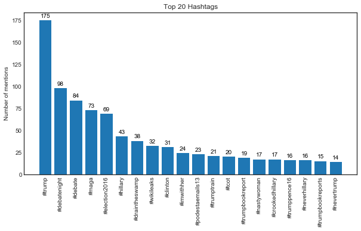


It looks like these Tweets were collected in the night just after a presidential debate.


```python
l = []
tweets.urls.apply(lambda x: [l.append(i.lower()) for i in x])
Counter(l).most_common(50)

url_counts = Counter(l).most_common(20)

for i in url_counts:
    print(i[0], '- {} shares '.format(i[1]))
```

    https://twitter.com/double_cupp_me/status/789088080426831872 - 10 shares 
    https://twitter.com/cnn/status/789249378280144896 - 9 shares 
    https://twitter.com/donaldjtrumpjr/status/789248030037774336 - 7 shares 
    https://twitter.com/tusk81/status/789134196614631425 - 6 shares 
    https://twitter.com/politico/status/789226507579326464 - 6 shares 
    https://twitter.com/braddjaffy/status/789241511326183424 - 5 shares 
    https://twitter.com/danmannarino/status/789248901337538562 - 5 shares 
    https://twitter.com/keitholbermann/status/789243226624520194 - 5 shares 
    http://bit.ly/2eyenr8 - 5 shares 
    https://twitter.com/rpyers/status/789235556253249536 - 4 shares 
    http://cbsnews.com/live - 4 shares 
    http://www.foxnews.com/politics/2016/10/20/clintons-debate-reference-to-nuclear-response-time-raises-eyebrows.html - 4 shares 
    https://twitter.com/blicqer/status/789249666923626497 - 4 shares 
    http://www.breitbart.com/video/2016/10/20/cnns-starr-clintons-answer-on-nuke-launch-time-used-extremely-classified-info-military-not-especially-thrilled/ - 4 shares 
    https://twitter.com/ajdelgado13/status/789235438254972929 - 4 shares 
    http://www.breitbart.com/big-government/2016/10/20/yougov-poll-undecided-third-party-voters-liked-trump-3rd-debate/ - 4 shares 
    https://twitter.com/chrislhayes/status/789218961938415616 - 4 shares 
    https://twitter.com/trumpsuperpac/status/789113843242921984 - 4 shares 
    http://www.huffingtonpost.com/entry/donald-trump-confuses-birth-with-abortion-and-no-there-are-no-ninth-month-abortions_us_5808dfa2e4b0dd54ce389b61?ncid=engmodushpmg00000004 - 4 shares 
    https://twitter.com/politico/status/789250113176793088 - 4 shares 


# Bag-of-words and parts of speech model

### TF-IDF Model

Words are converted to SpaCy tokens to create the bag-of-words model. Only nouns and adjectives are counted. Words that don't carry much information (called "*[Stop words](https://gist.github.com/sebleier/554280)*"), are filtered. Also, words are converted to their "*lemmas*" (or stem words) and then concatenated with their "*parts of speech*" (whether they're nouns, adjectives, etc...). Finally, only words that occur at least 20 times are taken into consideration.

A "*TF-IDF Matrix*" is then created. Unique weights are calculated for each sentence combining the *Term Frequency* and the *Inverse Document Frequency*:

$$tfidf_{t,d}=(tf_{t,d})(idf_t)$$

Where:

$$ tf_{t,d} = ft,d$$

    (number of times a term appears in a document) / (total number of terms in the document)


$$idf_t=log \dfrac N{df_t}$$
    
    log_e(Total number of documents / Number of documents with term t in it)


The tf_idf score will be highest for a term that occurs a lot within a small number of sentences, and lowest for a word that occurs in most or all sentences.


```python
# instantiate the SpaCy module
nlp = spacy.load('en')

# custom tokenizing function
def my_tokenizer(doc):
    tokens = nlp(doc)
    return([(token.lemma_ + token.pos_) for token in tokens
            if not token.is_stop
            and not len(token.text) == 1
            and (token.pos_=='NOUN' or token.pos_=='ADJ' or token.pos_=='ADV')])

custom_vec = TfidfVectorizer(tokenizer=my_tokenizer,
                             max_df=.5, # drop words that occur in more than XX% of the paragraphs
                             min_df=20, # only use words that appear at least X times
                             ngram_range=(1,2), # use terms with one and two words
                             use_idf=True,# we definitely want to use inverse document frequencies in our weighting
                             norm=False, # 'l2' applies a correction factor to treat longer and shorter paragraphs equally
                             smooth_idf=True) #Prevents divide-by-zero errors
```


```python
start_time = time.time()

tfidf_matrix = custom_vec.fit_transform(tweets.cleaned_text)

print("--- %s seconds ---" % (time.time() - start_time))
```

    --- 67.42899203300476 seconds ---


```python
# instantiate series to store tokens, tweets, and hashtags information
tokens = custom_vec.get_feature_names()
clean_tweets = tweets.cleaned_text
hashtags = tweets.hashtags
```

# Finding topics and representative sentences

Let's calculate Sentence Similarity and identify representative tweets as those which are highly similar to other tweets. The fifty tweets with the highest median similarity score will be sorted to identify the most important sentences in the data set.

We'll use Sklearn's *cosine_similarity* method to calculate the cosine of each tweet's TF-IDF vectors. Sklearn's cosine_similarity method computes similarity as *the normalized dot product of X and Y:

$$K(X,Y) =  <X,Y> / (||X||*||Y||)$$


The output is a similarity matrix where each row has the cosine values of that row's tweet, and all other tweets.

The cosine similarity of two vectors is a number between 0 and 1.0 where a value of 1.0 means the two vectors are exactly the same.

**Let's generate the similarity matrix and select a random sentence to see the other tweets that are most similar to it.**


```python
# generate a sentence similarity matrix
df_similarity = pd.DataFrame(cosine_similarity(tfidf_matrix), index=clean_tweets,
                            columns=clean_tweets)

sentence = 'donald i will totally accept election results if i win'
df_similarity[[sentence]].sort_values(by=[sentence],ascending=False)[:20]
```


<div>
<style scoped>
    .dataframe tbody tr th:only-of-type {
        vertical-align: middle;
    }

    .dataframe tbody tr th {
        vertical-align: top;
    }

    .dataframe thead th {
        text-align: right;
    }
</style>
<table border="1" class="dataframe">
  <thead>
    <tr style="text-align: right;">
      <th>cleaned_text</th>
      <th>donald i will totally accept election results if i win</th>
    </tr>
    <tr>
      <th>cleaned_text</th>
      <th></th>
    </tr>
  </thead>
  <tbody>
    <tr>
      <th>donald i will totally accept the election results if i win lol</th>
      <td>1.000000</td>
    </tr>
    <tr>
      <th>donald i will totally accept election results if i win cnn</th>
      <td>1.000000</td>
    </tr>
    <tr>
      <th>donald i will totally accept election results if i win var ooyoulaplayers ooyou</th>
      <td>1.000000</td>
    </tr>
    <tr>
      <th>donald i will totally accept election results if i win</th>
      <td>1.000000</td>
    </tr>
    <tr>
      <th>donald i pledge to totally accept election results if i win via</th>
      <td>0.971576</td>
    </tr>
    <tr>
      <th>donald says he will totally accept election results if he wins</th>
      <td>0.971576</td>
    </tr>
    <tr>
      <th>donald will totally accept election results if i win reports</th>
      <td>0.853649</td>
    </tr>
    <tr>
      <th>omg donald just said he will totally accept results if he wins this is unbelievable</th>
      <td>0.810032</td>
    </tr>
    <tr>
      <th>cnn news donald i will totally accept election results if i win</th>
      <td>0.779040</td>
    </tr>
    <tr>
      <th>ap donald mocks critics i ll accept election results _ if i win</th>
      <td>0.778515</td>
    </tr>
    <tr>
      <th>donald is saying that until knows the certified and verified election results he would not conce</th>
      <td>0.778515</td>
    </tr>
    <tr>
      <th>donald mocks critics i ll accept election results if i win</th>
      <td>0.778515</td>
    </tr>
    <tr>
      <th>s stance on election results delusional</th>
      <td>0.741650</td>
    </tr>
    <tr>
      <th>flashback hillary clinton election result hypocrisy via</th>
      <td>0.741650</td>
    </tr>
    <tr>
      <th>donald breaks with tradition refuses to say he will accept election results via</th>
      <td>0.741650</td>
    </tr>
    <tr>
      <th>malik khan i ll accept election results if i win donald the indian</th>
      <td>0.741650</td>
    </tr>
    <tr>
      <th>what would happens if donald chose to challenge the us election result independent</th>
      <td>0.741650</td>
    </tr>
    <tr>
      <th>ted cruz we have a democratic process i ve won elections i ve lost elections and i respect the results of an electi</th>
      <td>0.707298</td>
    </tr>
    <tr>
      <th>i will totally accept the results of the election if i win donald sounds like dudley dursley</th>
      <td>0.698601</td>
    </tr>
    <tr>
      <th>good for donald for not pre validating election results what a symbol for this terrible election that even whe</th>
      <td>0.672536</td>
    </tr>
  </tbody>
</table>
</div>


The first five sentences have a score of 1 meaning that they're perfectly identical. That's because terms such as "var", "ooyou", "lol", and "cnn" are ignored by our tfidf vectorizer.

Notice that sentences with scores above 0.5 have at least three shared words, and above 0.6 have at least six shared words. The order of words in sentences are also taken into consideration by the model.

To find the top most representative sentences from the data set, we'll create a feature with the *average cosine similarity score of all sentences* and rank sentences by that feature and extract the top 20 sentences.


```python
df_similarity.insert(0, 'mean_similarity', df_similarity.mean(axis=1))

df_similarity[['mean_similarity']].sort_values('mean_similarity',ascending=False).head(20)
```


<div>
<style scoped>
    .dataframe tbody tr th:only-of-type {
        vertical-align: middle;
    }

    .dataframe tbody tr th {
        vertical-align: top;
    }

    .dataframe thead th {
        text-align: right;
    }
</style>
<table border="1" class="dataframe">
  <thead>
    <tr style="text-align: right;">
      <th>cleaned_text</th>
      <th>mean_similarity</th>
    </tr>
    <tr>
      <th>cleaned_text</th>
      <th></th>
    </tr>
  </thead>
  <tbody>
    <tr>
      <th>donald warns that other communities are poised to steal the election</th>
      <td>0.107764</td>
    </tr>
    <tr>
      <th>donald will not promise he has going to accept fraudulent stolen election</th>
      <td>0.107764</td>
    </tr>
    <tr>
      <th>in donald we trust</th>
      <td>0.097612</td>
    </tr>
    <tr>
      <th>why donald could still pull off a surprise</th>
      <td>0.097612</td>
    </tr>
    <tr>
      <th>box office preview can jack reacher donald</th>
      <td>0.097612</td>
    </tr>
    <tr>
      <th>donald is taking advantage of a certain group of his followers who lack the knowledge for critical thinking and ana</th>
      <td>0.097612</td>
    </tr>
    <tr>
      <th>yesterday was the least orange i ve ever seen donald</th>
      <td>0.097612</td>
    </tr>
    <tr>
      <th>the closest donald will ever get to an emmy is when alec baldwin wins one for playing him</th>
      <td>0.097612</td>
    </tr>
    <tr>
      <th>rename it lol no it will always be remembered as the failed obamacare donald</th>
      <td>0.097612</td>
    </tr>
    <tr>
      <th>donald surrogates</th>
      <td>0.097612</td>
    </tr>
    <tr>
      <th>ramzpaul what will happen if donald does not concede via</th>
      <td>0.097612</td>
    </tr>
    <tr>
      <th>i cannot stand donald</th>
      <td>0.097612</td>
    </tr>
    <tr>
      <th>you sound like donald</th>
      <td>0.097612</td>
    </tr>
    <tr>
      <th>i pray daily for donald victory</th>
      <td>0.097612</td>
    </tr>
    <tr>
      <th>hypocritical draconian liberty university censors student s article denouncing donald</th>
      <td>0.097612</td>
    </tr>
    <tr>
      <th>utter bs they are not supporting donald because he has not a neocon like them they are warmongers</th>
      <td>0.097612</td>
    </tr>
    <tr>
      <th>hey doc is it to late to abort donald</th>
      <td>0.097612</td>
    </tr>
    <tr>
      <th>i will not stop saying this donald and his crew and followers are flirting with treason they will not tear down my republic don miles</th>
      <td>0.097612</td>
    </tr>
    <tr>
      <th>donald hates hispanics so much he ordered all his buildings to replace incandescent lightbulbs with europeandescent l</th>
      <td>0.097612</td>
    </tr>
    <tr>
      <th>cannot we just get lisa to turn donald into a pile of sh t like she did with chet</th>
      <td>0.097612</td>
    </tr>
  </tbody>
</table>
</div>


The sentences with highest average cosine similarity score don't seem too relevant. The top *mean similarity score* among all sentences is just 0.072. That's because our data set has many tweets about many topics.


# Unsupervised Clustering

We'll use unsupervised clustering methods to group our tweets and then recalculate the *mean cosine similarity scores* of sentences within clusters. The clusters should help sort sentences by topics and improve the quality of our model's sentence extraction.

We'll start by applying PCA to generate two features for plotting purposes. We'll plot the data in three dimensions to look at its geometry and gain insights over which clustering method to use, according to [this comparison of the clustering algorithms in scikit-learn](http://scikit-learn.org/stable/modules/clustering.html).

Also, we'll generate Kmeans clusters for our first clustering attempt. Kmeans is one of the most popular clustering methods, being relatively fast and scalable.

#### K-Means Clustering

K-means is a method to cluster data points with similar variances. The algorithm tries to choose means (called centroids) that minimize inertia. The formula for inertia is:

$$\sum(\bar{x}_c - x_i)^2$$

Inertia is the sum of the squared differences between the centroid of a cluster (the mean $\bar{x}_c$) and the data points in the cluster ($x_i$).  The goal is to define cluster means so that the distance between a cluster mean and all the data points within the cluster is as small as possible.

#### Evaluating Clusters

We'll use the *silhouette coefficient* method to evaluate our clusters. For each datapoint, the coefficient is the difference between the mean distance between that datapoint and all other points in its cluster ($a_i$) and the mean distance between that datapoint and all other points in the *nearest other* cluster ($b_i$), divided by whichever of the two values is highest:  

$$\dfrac{b_i-a_i}{max(b_i,a_i)}$$

The mean of the silhouette coefficients for all datapoints is the silhouette coefficient for that clustering solution on that data.  Values range from -1 for very bad clusters to +1 for very dense clusters.


```python
pca = PCA(n_components=3)

data3D = pca.fit_transform(tfidf_matrix.todense())

# Store results of PCA in a data frame
result=pd.DataFrame(data3D, columns=['PCA%i' % i for i in range(3)])
```


```python
n_clusters = [5, 10, 15, 20]

for i in n_clusters:
    kmeans_array = KMeans(
        n_clusters=i, algorithm='full', n_init=100).fit_predict(data3D)

    silhouette_avg = silhouette_score(data3D, kmeans_array)

    print('\nSilhouette avg {} clusters:'.format(i), silhouette_avg)

    # Plot initialisation
    fig = plt.figure()
    fig.set_figheight(6)
    fig.set_figwidth(10)
    ax = fig.add_subplot(111, projection='3d')
    ax.scatter(result['PCA0'], result['PCA1'], result['PCA2'], c=kmeans_array, cmap="tab20c", s=20)

    # draw axis lines through space:
    xAxisLine = ((min(result['PCA0']), max(result['PCA0'])), (0, 0), (0,0))
    ax.plot(xAxisLine[0], xAxisLine[1], xAxisLine[2], 'r')
    yAxisLine = ((0, 0), (min(result['PCA1']), max(result['PCA1'])), (0,0))
    ax.plot(yAxisLine[0], yAxisLine[1], yAxisLine[2], 'r')
    zAxisLine = ((0, 0), (0,0), (min(result['PCA2']), max(result['PCA2'])))
    ax.plot(zAxisLine[0], zAxisLine[1], zAxisLine[2], 'r')

    # label the axes
    ax.set_xlabel("PC1")
    ax.set_ylabel("PC2")
    ax.set_zlabel("PC3")
    ax.set_title("{} Clusters - Three PCA Components".format(i))
    plt.show()

    print('Number of observations per cluster:')
    print(pd.value_counts(kmeans_array))
    print('\n-------------')
```

    
    Silhouette avg 5 clusters: 0.6786792165126991


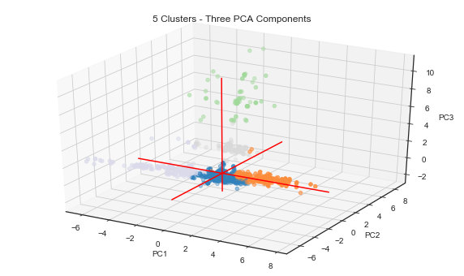


    Number of observations per cluster:
    0    3717
    1    740 
    3    548 
    4    199 
    2    78  
    dtype: int64
    
    -------------
    
    Silhouette avg 6 clusters: 0.6377492712231619


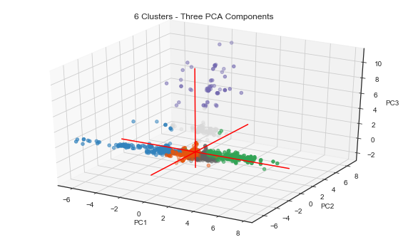


    Number of observations per cluster:
    1    2729
    4    1008
    2    732 
    0    536 
    5    199 
    3    78  
    dtype: int64
    
    -------------
    
    Silhouette avg 10 clusters: 0.6767536287470794


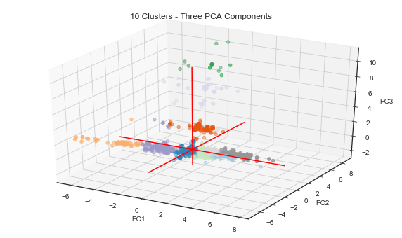


    Number of observations per cluster:
    0    2659
    5    1005
    9    521 
    6    487 
    2    198 
    8    141 
    1    98  
    3    94  
    7    62  
    4    17  
    dtype: int64
    
    -------------
    
    Silhouette avg 15 clusters: 0.6789738859619066


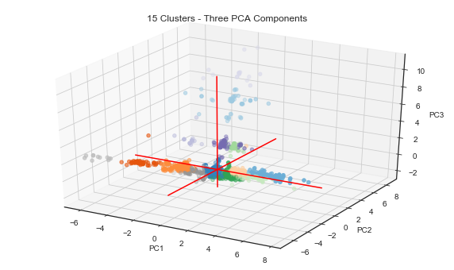


    Number of observations per cluster:
    0     2595
    6     1003
    5     507 
    4     410 
    1     141 
    12    124 
    9     123 
    8     98  
    3     84  
    7     68  
    2     61  
    14    23  
    11    17  
    10    17  
    13    11  
    dtype: int64
    
    -------------
    
    Silhouette avg 20 clusters: 0.6363455664815796


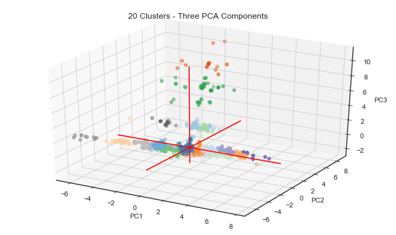


    Number of observations per cluster:
    0     2588
    5     876 
    19    410 
    1     355 
    15    133 
    9     123 
    2     123 
    3     101 
    13    90  
    11    90  
    7     75  
    10    68  
    18    67  
    8     61  
    6     45  
    14    21  
    16    17  
    4     17  
    12    11  
    17    11  
    dtype: int64
    
    -------------


We can see that our data does not have a flat geometry - observations were plotted with different z-axis values. Cluster sizes are uneven. There seems to be many clusters and they are mostly connected to each other.

Also, the shape of the data is definitely not isotropic - it does not have the same value when measured in different directions, but is rather stretched along the x-axis. This indicates that Kmeans is not the ideal clustering method.

Let's try using Agglomerative Clustering. According to Sklearn, the usecase for this method is when you have "*many clusters, possibly connectivity constraints, non Euclidean distances*".

Also, Agglomerative Clustering is a hierarchical clustering method, which may be useful for NLP data where there can be subtopics within topics. This may be the case with our observations within the flat geometry (the ones where z=0, and that are spread along the x=axis).

Still according to Sklearn, *the [AgglomerativeClustering](http://scikit-learn.org/stable/modules/clustering.html#hierarchical-clustering) object performs a hierarchical clustering using a bottom up approach: each observation starts in its own cluster, and clusters are successively merged together. The linkage criteria determines the metric used for the merge strategy: Ward minimizes the sum of squared differences within all clusters. It is a variance-minimizing approach and in this sense is similar to the k-means objective function but tackled with an agglomerative hierarchical approach.*


```python
from sklearn.cluster import AgglomerativeClustering

for i in n_clusters:
    
    ac_array = AgglomerativeClustering(
        n_clusters=i, linkage='ward').fit_predict(data3D)

    silhouette_avg = silhouette_score(data3D, ac_array)

    print('\nSilhouette avg {} clusters:'.format(i), silhouette_avg)

    # Plot initialisation
    fig = plt.figure()
    fig.set_figheight(6)
    fig.set_figwidth(10)
    ax = fig.add_subplot(111, projection='3d')
    ax.scatter(result['PCA0'], result['PCA1'], result['PCA2'], c=ac_array, cmap="tab20c", s=20)

    # draw axis lines through space:
    xAxisLine = ((min(result['PCA0']), max(result['PCA0'])), (0, 0), (0,0))
    ax.plot(xAxisLine[0], xAxisLine[1], xAxisLine[2], 'r')
    yAxisLine = ((0, 0), (min(result['PCA1']), max(result['PCA1'])), (0,0))
    ax.plot(yAxisLine[0], yAxisLine[1], yAxisLine[2], 'r')
    zAxisLine = ((0, 0), (0,0), (min(result['PCA2']), max(result['PCA2'])))
    ax.plot(zAxisLine[0], zAxisLine[1], zAxisLine[2], 'r')

    # label the axes
    ax.set_xlabel("PC1")
    ax.set_ylabel("PC2")
    ax.set_zlabel("PC3")
    ax.set_title("{} Clusters - Three PCA Components".format(i))
    plt.show()

    print('Number of observations per cluster:')
    print(pd.value_counts(ac_array))
    print('\n-------------')
```

    
    Silhouette avg 5 clusters: 0.6785167664415


    Number of observations per cluster:
    0    3717
    1    752 
    3    529 
    4    205 
    2    79  
    dtype: int64
    
    -------------
    
    Silhouette avg 6 clusters: 0.6306397460303999


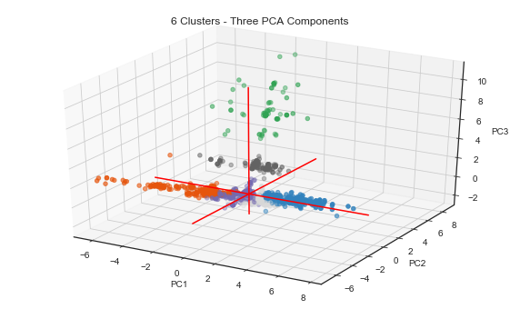


    Number of observations per cluster:
    3    2674
    5    1043
    0    752 
    1    529 
    4    205 
    2    79  
    dtype: int64
    
    -------------
    
    Silhouette avg 10 clusters: 0.633900767079328


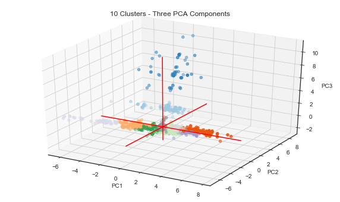


    Number of observations per cluster:
    8    2425
    5    1043
    9    484 
    3    436 
    4    249 
    1    205 
    2    158 
    6    110 
    7    93  
    0    79  
    dtype: int64
    
    -------------
    
    Silhouette avg 15 clusters: 0.6368890498622828


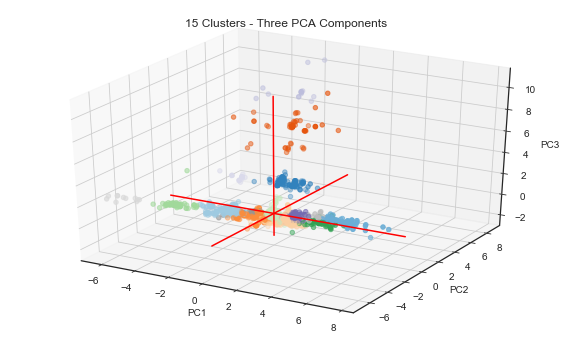


    Number of observations per cluster:
    8     2425
    5     1043
    9     484 
    2     415 
    4     249 
    0     190 
    6     110 
    1     108 
    7     82  
    3     64  
    13    50  
    12    21  
    11    15  
    10    15  
    14    11  
    dtype: int64
    
    -------------
    
    Silhouette avg 20 clusters: 0.5888009788447437


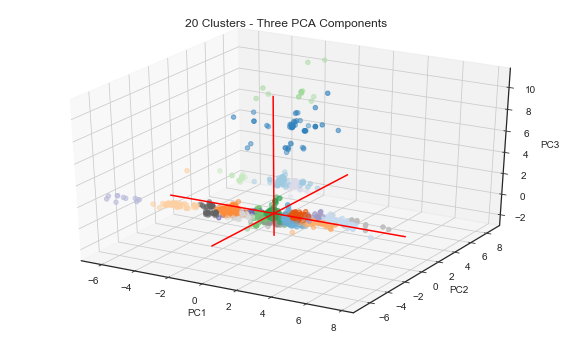


    Number of observations per cluster:
    8     2425
    1     945 
    4     484 
    5     361 
    9     177 
    2     123 
    6     110 
    17    98  
    3     97  
    7     82  
    19    72  
    15    67  
    0     64  
    16    54  
    13    50  
    12    21  
    10    15  
    11    15  
    14    11  
    18    11  
    dtype: int64
    
    -------------


Kmeans and Agglomerative Clustering produce similar results, both in terms of their silhouette scores and cluster sizes. Kmeans seems to have better grouped the data plotted on the z-dimension (or third component). This may be an indication that the method will be better fit for higher dimensional data.

#### Dimension reduction
Our data has 157 dimensions so it's worthwhile doing some dimension reduction.  We use the Singular Value Decomposition (SVD) function from sklearn rather than PCA because we don't want to mean-center our variables (and thus lose sparsity). SVD works well with sparse matrices and is frequently used on TF-IDF matrices.


```python
print('TF-IDF matrix shape', tfidf_matrix.shape)

start_time = time.time()

# use SVD to reduce the feature space and normalize the matrix
svd = TruncatedSVD(150)
lsa = make_pipeline(svd, Normalizer(copy=False))
lsa_matrix = lsa.fit_transform(tfidf_matrix)

# inspect the variance explained by our reduced features
variance_explained = svd.explained_variance_ratio_
total_variance = variance_explained.sum()

print("--- %s seconds ---" % (time.time() - start_time))

print("Percent variance captured by all components:", total_variance*100)
print('LSA matrix shape', lsa_matrix.shape)
```

    --- 0.47926926612854004 seconds ---
    Percent variance captured by all components: 86.02604595978387


Let's iteratively generate clusters with varied sizes and measure their silhouette scores. We'll choose the number of clusters that not only produces higher scores, but also clusters with similar sizes.


```python
n_clusters = [5,6,10,15,20]

for i in n_clusters:

    start_time = time.time()

    kmeans_array = KMeans(
        n_clusters=i, algorithm='full', n_init=50).fit_predict(lsa_matrix)

    print("\n--- {} seconds ---".format(time.time() - start_time))

    silhouette_avg = silhouette_score(lsa_matrix, kmeans_array)
    
    print('Silhouette avg {} clusters:'.format(i), silhouette_avg)
    
    print(pd.value_counts(kmeans_array))
```

    
    --- 5.214341878890991 seconds ---
    Silhouette avg 5 clusters: 0.09287863619790832
    3    3064
    1    723 
    4    676 
    0    559 
    2    260 
    dtype: int64
    
    --- 5.11779522895813 seconds ---
    Silhouette avg 6 clusters: 0.09832998884887101
    2    3041
    1    663 
    3    521 
    5    519 
    4    285 
    0    253 
    dtype: int64
    
    --- 4.46881103515625 seconds ---
    Silhouette avg 10 clusters: 0.10630160428793085
    5    2251
    1    668 
    3    624 
    0    441 
    4    303 
    2    277 
    9    249 
    8    184 
    6    158 
    7    127 
    dtype: int64
    
    --- 5.111907958984375 seconds ---
    Silhouette avg 15 clusters: 0.1334141795835857
    8     2265
    11    534 
    0     422 
    5     304 
    13    253 
    14    232 
    1     210 
    3     180 
    7     150 
    6     137 
    4     137 
    2     131 
    9     118 
    12    106 
    10    103 
    dtype: int64
    
    --- 6.262905120849609 seconds ---
    Silhouette avg 20 clusters: 0.1396938871111097
    12    2439
    9     367 
    15    301 
    13    230 
    4     223 
    18    221 
    6     216 
    8     153 
    17    151 
    2     139 
    0     137 
    7     123 
    11    115 
    1     99  
    5     97  
    10    73  
    14    66  
    3     53  
    19    46  
    16    33  
    dtype: int64


Both clustering methods produce smaller clusters (e.g., with less than 80 observations) as you increase the number of clusters. Although smaller clusters will generally have higher silhouette scores, we may not want to have clusters with too few samples, as it may be difficult to extract information from them. In this context, the best silhouette score / cluster sizes option seems to be 15 kmeans clusters.


```python
n_clusters = 15

start_time = time.time()

kmeans_array = KMeans(n_clusters=n_clusters, algorithm='full', n_init=100).fit_predict(lsa_matrix)

silhouette_avg = silhouette_score(lsa_matrix, kmeans_array)

print('Silhouette avg = {}'.format(silhouette_avg))

print("\n--- {} seconds ---".format(time.time() - start_time))

print(pd.value_counts(kmeans_array))
```

    Silhouette avg = 0.12860286801020168
    
    --- 11.928297281265259 seconds ---
    3     2732
    4     396 
    10    346 
    13    262 
    8     227 
    0     220 
    1     162 
    14    154 
    5     150 
    12    147 
    7     140 
    6     105 
    9     104 
    11    102 
    2     35  
    dtype: int64


```python
# store the LSA matrix in a pandas dataframe
df = pd.DataFrame(lsa_matrix, index=clean_tweets)
print(df.shape)
df.head(1)
```

    (5282, 150)


<div>
<style scoped>
    .dataframe tbody tr th:only-of-type {
        vertical-align: middle;
    }

    .dataframe tbody tr th {
        vertical-align: top;
    }

    .dataframe thead th {
        text-align: right;
    }
</style>
<table border="1" class="dataframe">
  <thead>
    <tr style="text-align: right;">
      <th></th>
      <th>0</th>
      <th>1</th>
      <th>2</th>
      <th>3</th>
      <th>4</th>
      <th>5</th>
      <th>6</th>
      <th>7</th>
      <th>8</th>
      <th>9</th>
      <th>10</th>
      <th>11</th>
      <th>12</th>
      <th>13</th>
      <th>14</th>
      <th>15</th>
      <th>16</th>
      <th>17</th>
      <th>18</th>
      <th>19</th>
      <th>20</th>
      <th>21</th>
      <th>22</th>
      <th>23</th>
      <th>24</th>
      <th>25</th>
      <th>26</th>
      <th>27</th>
      <th>28</th>
      <th>29</th>
      <th>30</th>
      <th>31</th>
      <th>32</th>
      <th>33</th>
      <th>34</th>
      <th>35</th>
      <th>36</th>
      <th>37</th>
      <th>38</th>
      <th>39</th>
      <th>40</th>
      <th>41</th>
      <th>42</th>
      <th>43</th>
      <th>44</th>
      <th>45</th>
      <th>46</th>
      <th>47</th>
      <th>48</th>
      <th>49</th>
      <th>...</th>
      <th>100</th>
      <th>101</th>
      <th>102</th>
      <th>103</th>
      <th>104</th>
      <th>105</th>
      <th>106</th>
      <th>107</th>
      <th>108</th>
      <th>109</th>
      <th>110</th>
      <th>111</th>
      <th>112</th>
      <th>113</th>
      <th>114</th>
      <th>115</th>
      <th>116</th>
      <th>117</th>
      <th>118</th>
      <th>119</th>
      <th>120</th>
      <th>121</th>
      <th>122</th>
      <th>123</th>
      <th>124</th>
      <th>125</th>
      <th>126</th>
      <th>127</th>
      <th>128</th>
      <th>129</th>
      <th>130</th>
      <th>131</th>
      <th>132</th>
      <th>133</th>
      <th>134</th>
      <th>135</th>
      <th>136</th>
      <th>137</th>
      <th>138</th>
      <th>139</th>
      <th>140</th>
      <th>141</th>
      <th>142</th>
      <th>143</th>
      <th>144</th>
      <th>145</th>
      <th>146</th>
      <th>147</th>
      <th>148</th>
      <th>149</th>
    </tr>
    <tr>
      <th>cleaned_text</th>
      <th></th>
      <th></th>
      <th></th>
      <th></th>
      <th></th>
      <th></th>
      <th></th>
      <th></th>
      <th></th>
      <th></th>
      <th></th>
      <th></th>
      <th></th>
      <th></th>
      <th></th>
      <th></th>
      <th></th>
      <th></th>
      <th></th>
      <th></th>
      <th></th>
      <th></th>
      <th></th>
      <th></th>
      <th></th>
      <th></th>
      <th></th>
      <th></th>
      <th></th>
      <th></th>
      <th></th>
      <th></th>
      <th></th>
      <th></th>
      <th></th>
      <th></th>
      <th></th>
      <th></th>
      <th></th>
      <th></th>
      <th></th>
      <th></th>
      <th></th>
      <th></th>
      <th></th>
      <th></th>
      <th></th>
      <th></th>
      <th></th>
      <th></th>
      <th></th>
      <th></th>
      <th></th>
      <th></th>
      <th></th>
      <th></th>
      <th></th>
      <th></th>
      <th></th>
      <th></th>
      <th></th>
      <th></th>
      <th></th>
      <th></th>
      <th></th>
      <th></th>
      <th></th>
      <th></th>
      <th></th>
      <th></th>
      <th></th>
      <th></th>
      <th></th>
      <th></th>
      <th></th>
      <th></th>
      <th></th>
      <th></th>
      <th></th>
      <th></th>
      <th></th>
      <th></th>
      <th></th>
      <th></th>
      <th></th>
      <th></th>
      <th></th>
      <th></th>
      <th></th>
      <th></th>
      <th></th>
      <th></th>
      <th></th>
      <th></th>
      <th></th>
      <th></th>
      <th></th>
      <th></th>
      <th></th>
      <th></th>
      <th></th>
    </tr>
  </thead>
  <tbody>
    <tr>
      <th>sharing selfies of completed ballots on social media a misdemeanor in colorado</th>
      <td>0.078309</td>
      <td>-0.003656</td>
      <td>-0.008551</td>
      <td>-0.028871</td>
      <td>-0.001864</td>
      <td>0.049346</td>
      <td>0.055685</td>
      <td>-0.009999</td>
      <td>-0.037856</td>
      <td>-0.091453</td>
      <td>-0.096652</td>
      <td>0.048802</td>
      <td>0.028505</td>
      <td>-0.118896</td>
      <td>-0.054523</td>
      <td>0.308595</td>
      <td>0.433269</td>
      <td>0.45525</td>
      <td>-0.088757</td>
      <td>-0.143402</td>
      <td>-0.206726</td>
      <td>-0.086718</td>
      <td>-0.220304</td>
      <td>0.052241</td>
      <td>0.087088</td>
      <td>0.140532</td>
      <td>-0.139233</td>
      <td>-0.039162</td>
      <td>0.121088</td>
      <td>0.054473</td>
      <td>0.026977</td>
      <td>0.008782</td>
      <td>0.128281</td>
      <td>-0.056699</td>
      <td>-0.038327</td>
      <td>0.140266</td>
      <td>0.090525</td>
      <td>-0.073755</td>
      <td>-0.017911</td>
      <td>-0.017322</td>
      <td>-0.021623</td>
      <td>-0.006979</td>
      <td>-0.01976</td>
      <td>-0.038579</td>
      <td>0.021223</td>
      <td>0.047348</td>
      <td>-0.040431</td>
      <td>-0.013592</td>
      <td>-0.027666</td>
      <td>-0.018579</td>
      <td>...</td>
      <td>0.026048</td>
      <td>0.00053</td>
      <td>-0.10713</td>
      <td>0.068972</td>
      <td>0.018017</td>
      <td>-0.084573</td>
      <td>-0.053025</td>
      <td>0.021583</td>
      <td>-0.037838</td>
      <td>0.055631</td>
      <td>0.072855</td>
      <td>0.043664</td>
      <td>0.004139</td>
      <td>0.009913</td>
      <td>-0.051535</td>
      <td>-0.058634</td>
      <td>-0.050868</td>
      <td>-0.075169</td>
      <td>-0.10223</td>
      <td>-0.057978</td>
      <td>-0.08309</td>
      <td>-0.024217</td>
      <td>-0.00681</td>
      <td>-0.012403</td>
      <td>-0.050111</td>
      <td>-0.025595</td>
      <td>0.04223</td>
      <td>-0.014363</td>
      <td>0.036137</td>
      <td>-0.083992</td>
      <td>0.031428</td>
      <td>-0.004479</td>
      <td>0.029492</td>
      <td>0.03139</td>
      <td>0.046955</td>
      <td>0.002485</td>
      <td>-0.034809</td>
      <td>0.039633</td>
      <td>0.066362</td>
      <td>-0.029901</td>
      <td>0.006956</td>
      <td>0.050354</td>
      <td>-0.04517</td>
      <td>-0.039809</td>
      <td>-0.081734</td>
      <td>-0.029532</td>
      <td>0.018392</td>
      <td>-0.023441</td>
      <td>0.015773</td>
      <td>0.092748</td>
    </tr>
  </tbody>
</table>
<p>1 rows × 150 columns</p>
</div>


```python
# insert a column to store kmeans clusters
df.insert(0,'kmeans', 0)

df['kmeans'] = kmeans_array

# generate a list with the top hashtags
top_hashtags = [i[0] for i in hashtag_counts]

# insert zero-valued columns with the names of the top hashtags
for i in top_hashtags:
    df.insert(1,i,0)

df.insert(0, 'hashtags', hashtags.values)

df.head(1)
```


```python
# reset the dataframe index
df.reset_index(inplace=True)

# count the occurrence of each of the top hashtags
for i, hashlist in enumerate(df.hashtags):
    for hashtag in hashlist:
        if hashtag in top_hashtags:
            df.loc[i,hashtag]+=1

tweets['kmeans_clusters'] = df.kmeans.values
            
df[['hashtags','maga','trumppence16','debatenight']][df.maga!=0].head(6)
```


```python
df.iloc[:,2:23].groupby('kmeans').sum().plot.bar(figsize=(25,8),colormap='tab20')
plt.show()
```


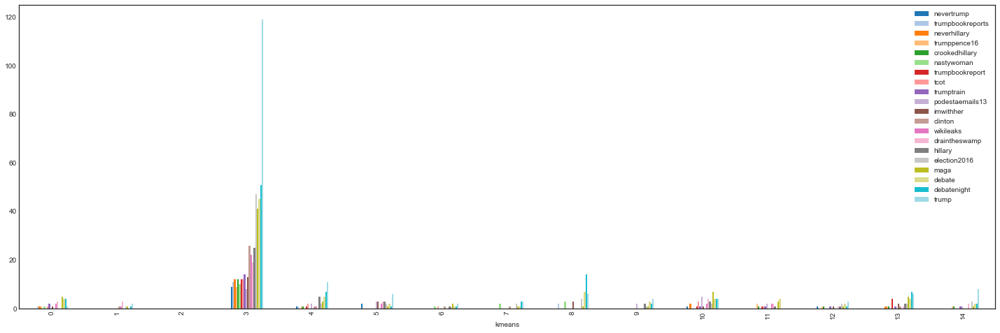


### Iterate over clusters and extract sentences with the n-top cosine similarity scores
Now that we have our clusters, we'll calculate cosine_similarity and see if the tweets with the highest median similarity score are grouped into similar, representative topics.

We'll generate cosine similarity matrices for each cluster, and extract the top-10 sentences with the highest mean similarity scores.


```python
def get_similarities(num_sents):
    
    sim_sents = collections.OrderedDict()
    
    mean_sims = {}
    
    for i in range(n_clusters):
        
        df_similarity = pd.DataFrame(cosine_similarity(tfidf_matrix[kmeans_array==i,:]),
                                   index=clean_tweets[kmeans_array==i],
                                   columns=clean_tweets[kmeans_array==i])
        
        df_similarity.insert(0, 'mean_similarity', df_similarity.mean(axis=1))
        
        mean_similarity = df_similarity.mean_similarity.mean()
        
        mean_sims['cluster {}'.format(i)] = mean_similarity

        top_sents = df_similarity.sort_values('mean_similarity',ascending=False)[:num_sents].index
        
        sim_sents['cluster_{} | {} tweets | mean similarity: {}'.format(
            i, df_similarity.shape[0], mean_similarity)] = top_sents

    return sim_sents, mean_sims
```

Let's print out our sentences for two clusters, along with the number of tweets and the cluster's mean similarity scores.


```python
sim_10, cluster_sims = get_similarities(10)

for key, value in sim_10.items():
    print('\n--------------\n',key)
    for j, sent in enumerate(value):
        print('\n{})'.format(j),sent)
```

    
    --------------
     cluster_0 | 220 tweets | mean similarity: 0.8042079257647378
    
    0) in donald
    
    1) let us pray for donald j donald
    
    2) what a dick donald is
    
    3) does this at a funeral says donald is offensive
    
    4) from someone who got a very close look in donald s head and heart his ghost writer compelled to speak up
    
    5) donald said give me a break when clinton said he called machado an eating machine via buzzfeed
    
    6) hillary is awesome donald is a prick but you go with him
    
    7) obama rips marco rubio for supporting donald
    
    8) it is amazing you fools think donald has never done anything illegal tomi if you were not cute you had you would be jus ano
    
    9) donald does not know how to win what a looser
    
    --------------
     cluster_1 | 162 tweets | mean similarity: 0.3605542481941823
    
    0) in sen obama referred to hillary as a compromised washington insider
    
    1) lil marco mccain ryoun others need take notes as comes out swinging at obama hillary clinton for donald tr
    
    2) read this and watch part obama legacy is awful
    
    3) even malia and sasha obama have a crazy uncle who is voting for donald via
    
    4) obama in miami obama feeds us with his hope donald feeds himself on our
    
    5) proof obama hillary clinton used the illegal private server lied to all of us about it h
    
    6) what about obama exe ord no flag pledge in schools
    
    7) will hillbilly clinton have room in her cell for obama
    
    8) donald is terrible but at least he never did a cappuccino salute like that classless obama
    
    9) clinton obama lose again duterte aligns philippines with china says u s has lost via
    
    --------------
     cluster_2 | 35 tweets | mean similarity: 0.49010577117827453
    
    0) you have done nothing but flap your gums and now you appoint yourself the arbiter of who is and is not pro life based on an orange buffoon
    
    1) neverdonald agonistes donald is the only pro life choice lifezette
    
    2) murderers are pro murder donald was pro hillary getting that is pro murder no one is pro rape
    
    3) breaking criminal hillary clinton involved in a million quid pro quo scandal via
    
    4) hillary clinton involved in a million quid pro quo scandal via
    
    5) she is trying to pander to catholics how can kaine be catholic and pro choice
    
    6) in defense of pro donald christians the dennis prager show very nicely said worth reading and rt ht
    
    7) where billionaire donald when the rest of us were trying to defund pp he was funding the pro choice politicians
    
    8) i m so pro hillary i just called my wife hancy the more i think about it the more i believe that donald has
    
    9) any christian voting for pro abortion hillary may the lord rebuke you vote for donald who is pro life
    
    --------------
     cluster_3 | 2732 tweets | mean similarity: 0.011697474494149495
    
    0) south carolina had enough time to flush down donald joe wilson vote for arik bjorn
    
    1) i am not a parody this is not the time for jokes vote donald
    
    2) guess what donald vote get your free sticker now
    
    3) you must vote vote for donald do not forget to vote
    
    4) perhaps mr scarry should try and remember that donald said he did not need our votes
    
    5) do not boo donald cannot hear you go vote and then he will
    
    6) i agree donald has my vote
    
    7) donald has no reason to lie he has not a politician that is why america loves him donald for president go donald
    
    8) i wonder what the odds are that donald remains civil the entire time
    
    9) one should remember that donald has been ahead for some time now
    
    --------------
     cluster_4 | 396 tweets | mean similarity: 0.30368382288007273
    
    0) this might have been the sickest burn of the entire election
    
    1) and what about russians yrs ago messing in our election would have branded donald a traitor h
    
    2) we are winning they want it to appear close so they can try to steal the election
    
    3) miss the last of the election we have got you covered
    
    4) who do you think is going to win the election rt for science
    
    5) pray for israel in all of this imagine the concern that they must have over the election
    
    6) this election and i cannot even vote yet
    
    7) i miss the window in this election where we just made fun of ted cruz for being the zodiac killer
    
    8) everyone always forgets when it fits their narrative we deserve this election hopefully the wake up seeds have been sown
    
    9) april grateful acts as wingman for freshly divorced election fixer on the georgetown cam
    
    --------------
     cluster_5 | 150 tweets | mean similarity: 0.33226643523491894
    
    0) it is not just donald himself so much ugly lying from the whole campaign
    
    1) of course donald s going to cash in on the millions of chumps who bought his crackpot conspiracy campaign
    
    2) we are glad to be back in pennsylvania on the campaign trail
    
    3) tim kaine campaigns in north carolina via
    
    4) donald campaign admits it has a secret weapon releases bombshell name via
    
    5) donald called hillary clinton s campaign sleazy and then i laughed so hard at his hypocrisy that i died i m dead
    
    6) miley cyrus to knock on doors for hillary clinton campaign
    
    7) busted for asking set up for campaign
    
    8) abandon ship donald loses another key campaign player
    
    9) gad read this thank you for posting not what you are hearing campaign crashing
    
    --------------
     cluster_6 | 105 tweets | mean similarity: 0.3855207021962376
    
    0) more videos
    
    1) disgusted by the whole video
    
    2) calls donald jabba the hutt w video
    
    3) this video will get donald elected please watch especially
    
    4) hillary clinton and cecile richards coordinated defense of planned parenthood after shocking videos
    
    5) hillary clinton s robot eye revealed video
    
    6) please look at these videos that bring reality please st nd or rd term
    
    7) i liked a video farrakhan to obama let donald get elected because you failed blacks
    
    8) video hillary clinton s lifetime of scandal
    
    9) dear beautiful powerful wisconsin i made this video urging you to vote in this very importa
    
    --------------
     cluster_7 | 140 tweets | mean similarity: 0.4126248968067672
    
    0) donald is saying that until knows the certified and verified election results he would not conce
    
    1) ap donald mocks critics i ll accept election results _ if i win
    
    2) donald mocks critics i ll accept election results if i win
    
    3) s stance on election results delusional
    
    4) donald breaks with tradition refuses to say he will accept election results via
    
    5) malik khan i ll accept election results if i win donald the indian
    
    6) flashback hillary clinton election result hypocrisy via
    
    7) what would happens if donald chose to challenge the us election result independent
    
    8) of course donald will not accept the results of the election he will not even accept the results of his scalp
    
    9) ted cruz we have a democratic process i ve won elections i ve lost elections and i respect the results of an electi
    
    --------------
     cluster_8 | 227 tweets | mean similarity: 0.35098356495752586
    
    0) donald nobody respect woman more than i do donald interrupts a woman while she is talking to call her a nasty woman on li
    
    1) donald nobody respects women more than me also donald such a nasty woman
    
    2) beck hits donald for calling clinton a nasty woman when hes cratering with women
    
    3) huge cheers when flotus says donald sees women solely for entertainment and pleasure rather than human beings worthy of love a
    
    4) every woman wants to be famous for being groped donald gets us
    
    5) i believe it is possible assaulted so many women over decades that he may well have forgotten some of them
    
    6) donald nobody respects women more than i do
    
    7) i am quite positive this is merely the tip of the iceberg of women who have been violated by his unwanted unwarranted a
    
    8) when donald says no one respects women more than he does
    
    9) that picture make no sens donald would never hit a woman she must of felt
    
    --------------
     cluster_9 | 104 tweets | mean similarity: 0.3782696442828415
    
    0) another successful day at where silent majority stands with we ran out of apparel but there will be more tomorrow
    
    1) donald let us talk about china i was in panda express the other day
    
    2) to ensure damaging or incriminating documents never saw the light of day he added
    
    3) this made my day
    
    4) i ve been thinking about this article all day donald is the first demagogue of the anthropocene
    
    5) i hope the ratings boost and got from being donald groupies from day was worth the destruct
    
    6) watb of the day donald jr
    
    7) this makes me feel like edith bunker warbling those were the days lovely
    
    8) flotus reminds us that there is only nineteen days until the election
    
    9) okay all it is now october th means only days left of this crazy election ahhhhh
    
    --------------
     cluster_10 | 346 tweets | mean similarity: 0.2522718983371543
    
    0) christopher hitchens ends hillary clinton compilation
    
    1) click click at in clinton township mi
    
    2) first up who knew matt clinton
    
    3) if your blood pressure is rising watching clinton and donald listen to what your body is tellingg you and
    
    4) clinton v donald
    
    5) like what seriously what freedoms do you think will be stripped with a clinton victory
    
    6) if pictures can say anything this is the judgement of ms clinton
    
    7) what clinton is doing goes against the uniform code of military justice even though she is not in the military she is a government official
    
    8) surely you jest clintons are all flawed
    
    9) i ve read every book obama michelle valerie jarrett hate both clinton s knew something up when michelle praised her
    
    --------------
     cluster_11 | 102 tweets | mean similarity: 0.49397516477344017
    
    0) heart wrenching tweetstorm describes clinton foundations lifesaving work via
    
    1) wikileaks bombshell hillary removed algeria from terror list after they donated to clinton foundation
    
    2) if you want to make millions just start a clinton like foundation
    
    3) methinks john q public figuring out clinton foundation is a nest of snakes
    
    4) wikileaks pelosi distancing herself from clinton foundation pelosi clintons will have to answer for
    
    5) donald hillary should give back clinton foundation money to islamic governments
    
    6) haitian president exposes the clinton foundation hillary clinton tried to bribe me
    
    7) nobody investigates the irs the clinton foundation planned parenthood no doj no media notta
    
    8) haitians protest outside hillary clintons office over billions stolen by clinton foundation
    
    9) wikileaks emails reveal clinton foundation conflicts of interest via
    
    --------------
     cluster_12 | 147 tweets | mean similarity: 0.3696728470194672
    
    0) either donald or clinton wins haha lbr they are not that umm any better haha sorry yes i said it
    
    1) good luck
    
    2) so good
    
    3) looking good hill fortunately sans pussybow
    
    4) except hillary is better than donald
    
    5) is just a fundamentally shitty human being being a good businessman by no means makes up for it
    
    6) keep up the fight good for you
    
    7) you wanna give me a good send off go knock on some doors
    
    8) good luck getting that apology
    
    9) agreed no good trash kelly
    
    --------------
     cluster_13 | 262 tweets | mean similarity: 0.31585054967318815
    
    0) interesting take hillary clinton mocking and taunting in debate turns the tormentor
    
    1) hillary clinton mocking and taunting in debate turns the tormentor
    
    2) did hillary clinton reveal classified intel at the debate
    
    3) oh my deflated defeated low stamina body language after the debate says it all
    
    4) on debate hillary clinton has managed to distinguish herself even among politicians for her willingness to
    
    5) outstanding for debate sweep for nobody has ever been more prepared to be
    
    6) and hillary clinton had a record on the debates of net lies what a disgrace
    
    7) those are not debate note but margin doodle on notepad is not need take note all thought is direct to mouth without pause
    
    8) donald won the third debate by via
    
    9) yes and why did not donald bring this up in the debate
    
    --------------
     cluster_14 | 154 tweets | mean similarity: 0.3979855236842219
    
    0) i m horrified that people believe she can be horrified by anything
    
    1) many many people are talking
    
    2) stop talking and start listening to the people for for
    
    3) lol people
    
    4) yep he has gonna lose in a landslide pretty sure that means average people are offended by him
    
    5) this is just crazy his can people afford this
    
    6) why is it that people fail to see inability to stay on topic yet still people choose to support a walking train wreck
    
    7) people compare donald to hitler but he has never killed anyone hillary clinton has but that is none of my benghazi
    
    8) when you try to sow the seeds of doubt in people s minds about the legitimacy of our electionsthen that undermines ou
    
    9) people supporting hillary bc they hate donald is so idiotic vise versa you ppl make no sense its ok to hate not support both of them


Some clusters are fairly similar, but none are quite impressive. The maximimum cluster similarity was 0.588 (cluster 14, with 86 tweets.) Averge cluster similarity was just 0.32.


```python
print('Maximum cluster similarity:', max(cluster_sims.values()))
print('Minimum cluster similarity:', min(cluster_sims.values()))
print('Mean cluster similarity:', np.mean(list(cluster_sims.values())))

cluster_sims
```

    Maximum cluster similarity: 0.8042079257647378
    Minimum cluster similarity: 0.011697474494149495
    Mean cluster similarity: 0.3773113646318119


    {'cluster 0': 0.8042079257647378,
     'cluster 1': 0.3605542481941823,
     'cluster 10': 0.2522718983371543,
     'cluster 11': 0.49397516477344017,
     'cluster 12': 0.3696728470194672,
     'cluster 13': 0.31585054967318815,
     'cluster 14': 0.3979855236842219,
     'cluster 2': 0.49010577117827453,
     'cluster 3': 0.011697474494149495,
     'cluster 4': 0.30368382288007273,
     'cluster 5': 0.33226643523491894,
     'cluster 6': 0.3855207021962376,
     'cluster 7': 0.4126248968067672,
     'cluster 8': 0.35098356495752586,
     'cluster 9': 0.3782696442828415}


### Topic extraction

If we break down the clusters further, we may find *Latent Variables*, which can be thought of as hidden topics within the data. For example, the word *election* may be featured in different hidden topics (e.g., *election day* vs. *election result*). We’ll use **Non-Negative Matrix Factorization** (NNMF) to extract our latent variables.

NNMF is a dimension reduction method similar to PCA that searches for two matrices that, when multiplied together, result in the original TF-IDF matrix. The method applies a constraint that all three matrices must contain no negative values, leading to approximate values:

$$tfidf \approx WH$$

In text modeling, $W$ represents the topics, and $H$ describes whether, and to what extent, each topic applies to each document.

Sklearn's NNMF method applies the coordinate descent algorithm to find values for $W$ and $H$ that result in a matrix as close to the original TF-IDF matrix as possible. As with LSA, the goal is to reproduce the TF-IDF matrix using a smaller set of components, which we then call 'topics.' Components with the highest loading indicate a greater probability of featuring a given topic.

We'll use NMF to extract topics from clusters. To do so, we'll apply NMF to each cluster in our TF-IDF matrix and **generate a _components matrix_ where the rows are the TF-IDF vectors of all tweets within a cluster, and the columns are the NMF components**. The number of resulting components will be proportional to the number of tweets within clusters.

Then, for each *components matrix*, we'll iterate over its columns and **extract the top-ten tweets that have the highest component loadings**.


```python
def extract_topics(method, tfidf_mtx, num_sents):
    
    sim_sents = collections.OrderedDict()

    for i in range(n_clusters):
        
        temp_index = clean_tweets[kmeans_array==i]
        
        len_cluster = len(temp_index)
        
        temp_matrix = tfidf_mtx[kmeans_array==i,:]
        
        n_components = int(np.ceil(temp_matrix.shape[0] * .01))
        if n_components > 10:
            n_components = 10
        
        print('Cluster {}: {} observations'.format(i, len_cluster))
        
        # instantiate SVD, LDA and NMF to reduce the feature space and normalize the matrix
        svd = TruncatedSVD(n_components)
        lsa = make_pipeline(svd, Normalizer(copy=False))

        lda = LDA(n_components=n_components,
                  doc_topic_prior=None, # prior = 1/n_documents
                  topic_word_prior=1/20,
                  learning_decay=0.7, # convergence rate
                  learning_offset=10.0, # causes earlier iterations to have less influence on the learning
                  max_iter=20, # when to stop even if the model is not converging (to prevent running forever)
                  evaluate_every=-1, # do not evaluate perplexity, as it slows training time
                  mean_change_tol=0.001, # stop updating the document topic distribution in the E-step when mean change is < tol
                  max_doc_update_iter=100, # when to stop updating the document topic distribution in the E-step even if tol is not reached
                  n_jobs=1, # set to -1 to use all available CPUs to speed up processing time
                  verbose=0, # amount of output to give while iterating
                  random_state=0
                 )

        nmf = NMF(alpha=0.0, 
                  init='nndsvdar', # how starting value are calculated
                  l1_ratio=0.0, # Sets whether regularization is L2 (0), L1 (1), or a combination (values between 0 and 1)
                  max_iter=200, # when to stop even if the model is not converging (to prevent running forever)
                  n_components=n_components, 
                  random_state=0, 
                  solver='cd', # Use Coordinate Descent to solve
                  tol=0.0001, # model will stop if tfidf-WH <= tol
                  verbose=0 # amount of output to give while iterating
                 )

        # generate the components matrix
        if method == 'lsa':
            components = lsa.fit_transform(temp_matrix)
            print('Explained variance ratio:', sum(svd.explained_variance_ratio_))

        elif method == 'lda':
            components = lda.fit_transform(temp_matrix)

        else:
            components = nmf.fit_transform(temp_matrix)

        # store components to file
        np.save('{}_cl_{}.npy'.format(method, i), components)
        
        df_components = pd.DataFrame(components, index=clean_tweets[kmeans_array==i])
        
        for col in df_components.columns:
            top_sents = df_components[col].sort_values(ascending=False)[:num_sents].index
            sim_sents['cluster_{}, component {}'.format(i, col)] = top_sents
        
    return sim_sents
```


```python
nmf_topics = extract_topics('nmf', tfidf_matrix, 10)

for key, value in nmf_topics.items():
    print('\n--------------\n',key)
    for j, sent in enumerate(value):
        print('\n{})'.format(j),sent)
```

    Cluster 0: 220 observations
    Cluster 1: 162 observations
    Cluster 2: 35 observations
    Cluster 3: 2732 observations
    Cluster 4: 396 observations
    Cluster 5: 150 observations
    Cluster 6: 105 observations
    Cluster 7: 140 observations
    Cluster 8: 227 observations
    Cluster 9: 104 observations
    Cluster 10: 346 observations
    Cluster 11: 102 observations
    Cluster 12: 147 observations
    Cluster 13: 262 observations
    Cluster 14: 154 observations
    
    --------------
     cluster_0, component 0
    
    0) more donald lies more donald fraud taxes would likely show all his charity boasts are false you cannot trust donald
    
    1) i am proud to be american and to cast my first vote for mr donald there are lots of immigrants that love donald
    
    2) folks believe me if donald pres the will be allies against all thts bad he has strong donald is strong our g
    
    3) this is what we all should be doing show your support for mr donald by standing on any corner with your donald
    
    4) newsflash if you watched that interview of donald by matt lauer and did not gather that donald s a moron you are a mo
    
    5) ryoun you are undermining dem donald whoooooo ryoun donald i m jam packed w decadurabolin ryoun is that a steroid donald
    
    6) from the archives in the sun praised donald s big league credentials in the rj said donald makes mobsters
    
    7) donald is the gop without donald we go you fat moron
    
    8) donald has always sexualized women we are body parts for donald even donald s own daughters watch
    
    9) rolling the donald song unofficial donald via
    
    --------------
     cluster_0, component 1
    
    0) fake document just like the one with donald on it already proven
    
    1) breaking bombshell just exposed the fake donald groping plot
    
    2) holy crap dnc caught plotting fake donald groping rumors since may found in original h
    
    3) breaking bombshell wikileaks just exposed the fake donald groping plot bam dirty tricksters
    
    4) breaking bombshell wikileaks just exposed the fake donald groping plot
    
    5) wow must read commander in chief donald j patton donald
    
    6) rolling the donald song unofficial donald via
    
    7) please all go out and vote on november for donald j donald
    
    8) maine governor tells donald get over yourself
    
    9) michelle obama donald does not see our shared humanity
    
    --------------
     cluster_0, component 2
    
    0) tbh i m still terrified donald has a chance of winning
    
    1) will you the u s if donald is elected visit to enter for a chance to win k to head for canada
    
    2) gop silent on defending the democratic process against donald when their only chance is to denounce and defund him
    
    3) wow must read commander in chief donald j patton donald
    
    4) rolling the donald song unofficial donald via
    
    5) please all go out and vote on november for donald j donald
    
    6) rnc members agree with donald it is rigged
    
    7) i also stayed up for donald sounds horrible does not it almost like some kind of illness
    
    8) watch donald the coming landslide ancient prophecy voting donald
    
    9) donald is gonna be in asheville tomorrow
    
    --------------
     cluster_1, component 0
    
    0) look at cool headed obama running around doing her job what a mug he has proper flaping squeaky bum time obama donald president
    
    1) look at the campaigne hillary obama and others said the system is rigged obama and hillary are paying to have it rigged emails
    
    2) news michelle obama blasts donald as out of touch elitist first lady michelle obama ratche
    
    3) obama in miami obama feeds us with his hope donald feeds himself on our
    
    4) first lady michelle obama took the stage in phoenix today in support of hillary clinton s campaign for president
    
    5) rt if you agree president obama should be at work right now instead of campaigning at a clinton rally in fl
    
    6) live stream president obama rally for hillary clinton in miami gardens
    
    7) for first lady donald is he who shall remain nameless phoenix ap first lady michelle obama has emerged a
    
    8) for first lady donald is he who shall remain nameless phoenix ap first lady michelle obama has emerged as
    
    9) president obama donald wants to make america great but hes not part of the solution he has part of the problem
    
    --------------
     cluster_1, component 1
    
    0) us election obama calls donald s election rhetoric dangerous president barack obama says republican donald
    
    1) us election obama calls donald s election rhetoric dangerous bbc news however he forgot his acorn
    
    2) bbc news us election obama calls donald s election rhetoric dangerous
    
    3) michelle obama says donalds rigged election talk threatens idea of america abc news
    
    4) michelle obama says donald s rigged election talk threatens idea of america abc news via
    
    5) president obama slams donald s rigged election claims as dangerous
    
    6) obama slams donald s rigged election claims as dangerous
    
    7) obama says donald s election talk of not accepting the result is not a joking matter it undermines our democracy ht
    
    8) obama says donald s rigged election talk is not a joking matter
    
    9) haha and obama called out donald blaming others rigged election obama the ultimate blame game w republicans own your
    
    --------------
     cluster_2, component 0
    
    0) murderers are pro murder donald was pro hillary getting that is pro murder no one is pro rape
    
    1) how many pro life laws have you ushered through state legislaturea laura how many pro life counseling centers have you run
    
    2) any christian voting for pro abortion hillary may the lord rebuke you vote for donald who is pro life
    
    3) hillary clinton is aggressively pro abortion church needs to speak up and strongly condemn voting pro abor
    
    4) partial birth abortion is better than what clinton wants and you know what people change he is pro life
    
    5) i m pro life i support restrictions around abortion still not voting for donald
    
    6) so donald is pro life and yet does not care about the citizens who die from undue gun violence annually gotcha
    
    7) donald is pro life the protection of the fetus who has rights he feels he would never tear a baby dead from the womb mom s safety st
    
    8) neverdonald agonistes donald is the only pro life choice lifezette
    
    9) you have done nothing but flap your gums and now you appoint yourself the arbiter of who is and is not pro life based on an orange buffoon
    
    --------------
     cluster_3, component 0
    
    0) this is what should be reporting that donald is right can american be that stupid yes tell donald report on that
    
    1) donald will not commit to support our election outcome wont condemn putin and will not defend american democracy yet he wants t
    
    2) lindsey graham on donald s rigged remarks mr donald is doing the party and country a great disservice
    
    3) this is just sick anti donald protestors probably paid thugs by soros and the dnc peppersray kids at a donald rally this
    
    4) crazy donald followers claiming that they are ready for civil war donald has been the worst zombie virus in this country where is the antidote
    
    5) business finance for donald challenging an election loss would be tough reuters if donald were t
    
    6) the real donald watch a statesman the donald the media do not want you to ever see
    
    7) for donald challenging an election loss would be tough if donald were to challenge the outcome of next
    
    8) always amazes me how much credit everyone gives putin clinton putin s masterminding us election donald putin outsmarts
    
    9) reuters top news for donald challenging an election loss would be tough reuters if
    
    --------------
     cluster_3, component 1
    
    0) backstage al smith dinner mayor deblasio melania and donald cardinal dolan hillary clinton al smith and gover
    
    1) looking amazing at al smith dinner and no handshake at dinner with go
    
    2) omfg i can not believe hillary and donald are doing the al smith dinner tonight thought for sure the tradition would die with this election
    
    3) al smith dinner tonight sec clinton and moron donald will be there must see tv at pm most cable stations cspan highly recommend
    
    4) hillary knocks out donald tonight at the al smith dinner live on cspan
    
    5) an exclusive preview of me watching donald and clinton banter at the al smith dinner tonight
    
    6) breaking on donald and hildabeast will be sitting at the same table at tonight s annual al smith dinner in nyc
    
    7) i ve seen some posts asking if the al smith dinner would be streamed with speeches live stream
    
    8) hillary clinton and donald do not shake hands or acknowledge each other as they sit for al smith dinner seat away from wan other
    
    9) live donald and hillary clinton speech at alfred e smith dinner via
    
    --------------
     cluster_3, component 2
    
    0) apparently media ok w uranium voter fraud but questioning voter fraud or fraud election is unpatriotic
    
    1) shock poll of voters have concerns over voter fraud and election security
    
    2) donalds voter fraud claims ignore the biggest fraud in the campaign himself
    
    3) white house denies obama is friends with dem op who met president times and admitted to voter fraud zero hedge htt
    
    4) all i hear on tv is donald bashing he knew ted cruz criminal probe into voter fraud operative visits to white house so the right answer
    
    5) poll challenger in the election recalls the rampant voter fraud she witnessed at polling places a warning thank
    
    6) when ur party commits voter fraud and violent intimidation tactics americans doubt election integrity
    
    7) coming up on fox news why cases of voter fraud per year means the election is rigged and donald must be dec
    
    8) if media says clinton won i want recount every county every state for voter fraud and million donald march on washin
    
    9) donalds claims of voter fraud have been debunked repeatedly tune into now to learn more from richard hasen an el
    
    --------------
     cluster_3, component 3
    
    0) yes go vote get it done nov th you can sit back and watch the election feeling great that you voted vote vote vote
    
    1) i like jill but i also know a vote for her is a vote for hillary impossible win taking votes away from donald make sense
    
    2) russia vote for peace vote for or we will respond to the first strike by nuking every us city maga
    
    3) vs on taxes if you want more take home pay vote donald if you want less take home pay vote hillary
    
    4) bernie sanders warns a third party vote is a vote for donald
    
    5) my vote for the nov election president and vice president donald pence note donald get my vote by
    
    6) competing in hillary vs donald has votes vote ur celeb to win
    
    7) they love russia so i suggest they make their home there vote for all americans
    
    8) great debate finally heard about the issues facing americans continue to discuss voters to hear you will own the votes
    
    9) americans unite this country vote blue do notbecome complacent hillary clinton for president stronger together never donald ever
    
    --------------
     cluster_3, component 4
    
    0) i feel like most donald supporters at least acknowledge his flaws whereas hillary supporters act like she is a deity who can do
    
    1) quick note of thanks to donald supporters showing more heart compassion to women lgbts than hillary supporters
    
    2) donald supporters every time hillary actually says something logical after donalds nonsensical rambling
    
    3) donald supporters were sore losers as kids like if they lost they will run and go tell an adult even if they lost fair
    
    4) i had to click on your name just to make sure you did not unfollow me even tho im not a donald supporter
    
    5) thanks for calling this donald supporter out next joe scarborough
    
    6) donald s supporters can return to their hole in the ground called the reform party he will be toxic after this no one can r
    
    7) donald s supporters can return to their hole in the ground called the reform party he will be toxic after this no one can replace him
    
    8) when a donald supporter says name me one war america has created
    
    9) make sure you get out and vote on november th donald keeping my fingers crossed that donald supporters follow that genius advice
    
    --------------
     cluster_3, component 5
    
    0) donald said some stupidity re bad hombres spanish lesson hombre man hambre hunger hombro shoulder ombre kardashia
    
    1) did he say bad hombres or bad harambe
    
    2) donalds bad hombres comment sparks social media frenzy
    
    3) to some donald s bad hombres is much more than a botched spanish word
    
    4) screwed the pooch tonight bigly the st handful of many sniffles and bad hombres happened not presidential
    
    5) target practice i m a bad bad mans let us go and hurry
    
    6) donald really just said bad hombres when talking about immigration i cannot believe this is real
    
    7) donald on immigration we have some bad hombres here
    
    8) and everywhere scream duh seriously wtf get your bad hombre know nothing grabby paws off my pussy and s
    
    9) i regret to inform you that the bad hombres are at it again
    
    --------------
     cluster_3, component 6
    
    0) clinton my dream is hemispheric common market with open trade open borders donald she wants open borders politifac
    
    1) crooked hillary has never created a job in her life we will create million jobs think she can do that not a chan
    
    2) crooked hillary promised k jobs in ny and failed we will create m jobs when i m president and i will deliver htt
    
    3) last night exposed clinton corruption in haiti open borders hillary s disdain for constitution what is media t
    
    4) clinton wants open trade and open borders donald j donald for president
    
    5) moderator hillary paid by a brazilian bank for a speech that called for open borders that is a quote
    
    6) donald rightly points out that hillary wants open borders and no walls on the border unbelievable
    
    7) democratsgift americas pot crappy schools killing cops open borders weak and decimated military no jobs obscene
    
    8) chris collins sharp businessman for donald right on mr collins jobs jobs jobs
    
    9) agree the corrupt media supports the corrupt hillary gave of their donations to her media is trying desperatel
    
    --------------
     cluster_3, component 7
    
    0) this i m happy to compare my years of experience with your years hillary to donald
    
    1) i m happy to compare my years of experience with your years hillary to donald
    
    2) the republican dilemma republican confession from years ago has a lot to say about this years election via
    
    3) years of experience is hillary clinton as first lady of america she traveled to over countries fighting for women and
    
    4) years of experience for hillary clinton as first lady is marching with stop the violence tough on crime movement to st
    
    5) years of experience for hillary clinton as secretary of state is traveling to countries rebranding rebuilding the
    
    6) years of experience for hillary clinton is her as first lady taking on pharmaceutical and insurance companies getting
    
    7) years of experience for hillary clinton is as first lady being a voice in the lgbt community the first to march in a g
    
    8) via the most retweeted tweet of debate was once again a years old donald tweet
    
    9) years of experience for hillary clinton as a lawyer reforming the criminal justice system for african american youths in
    
    --------------
     cluster_3, component 8
    
    0) obama s a liar hillary clinton is a liar bill clinton is a liar dnc is a liar they are all liars
    
    1) liar liar pantsuits on fire you must be terrified at this point knowing your a loser donald loves america unlike you o
    
    2) clinton is confirmed serial liar only question is how many fools will still vote for a serial liar
    
    3) new ad calls a liar via
    
    4) it is rich for a guy like donald who lies of the time to call anyone a liar hc continues to stay classy in spite of the
    
    5) her response gave mr donald the middle finger no wonder he called that corrupt liar out
    
    6) you are a failure you have x more followers than donald but cant get likes or retweets on a post maybe because your liars
    
    7) donald calls hillary clinton a liar her response i m just quoting you via
    
    8) reports major donald staffer jumping ship by sarah p via latest from crooks and liars
    
    9) just said there are no emails from hillary clinton on nice mark spoken like the liar you are ht
    
    --------------
     cluster_3, component 9
    
    0) chris wallace im beginning to believe donald could be elected president breitbart
    
    1) chris wallace im beginning to believe donald could be elected president
    
    2) donald claims fox news s chris wallace rigged the debate for hillary clinton via loon
    
    3) donald claims fox news s chris wallace rigged the debate for hillary clinton via
    
    4) liberal chris wallace brought up the issue of donald acknowledging results he didnt need do that bush kasich said yes lied
    
    5) neither candidate bit on the grand bargain question last night but chris wallace certainly tried
    
    6) why didnt they ask donald and hillary who they think dies in the season premiere of twd smh chris wallace
    
    7) new election law should be that chris wallace moderates all debates from now on
    
    8) best debate yet chris wallace was a true respected journalist donald was solid on policy hillary tried to be personal
    
    9) chris wallace was a terrible moderator cutting hillary s time short so donald could speak about her foundation
    
    --------------
     cluster_4, component 0
    
    0) whats with will donald accept the election why ask al gore challenged outcome of elections so what we know these things
    
    1) democrats in the election was rigged democrats today shut up donald no election is ever rigged
    
    2) democrats just finished stealing an election against now they dont want you to talk about election rigging
    
    3) msm breaking news the russians are attempting to rig the us election by exposing how the us msm rigs the us election
    
    4) seriously this rigged election talk is crazy democrats have not rigged an election since this year s primaries
    
    5) your ballot material should be in the post or delivered to the election office by pm tonight the election office is at dana street
    
    6) hillary russia is rigging the election mins later it is dangerous to say the election is rigged
    
    7) we are dealing with a rigged election and debate and sexual comment to that are untrue rigged election and america
    
    8) this election is not politics as usual post election should not be business as usual the pundits and consultants supporting t
    
    9) im a republican election lawyer here s why the election cant be rigged via
    
    --------------
     cluster_4, component 1
    
    0) reuters if donald were to challenge the outcome of next month s presidential election as he has hinted he might he would
    
    1) i am way too fixated on the presidential election and i need some political novels to help get me through the next month
    
    2) losing very winnable presidential election to flawed opponent and likely to dispute election outcome
    
    3) absolutely excellent synopsis of united states presidential election take the time view logically process
    
    4) it is sad djt mr bad as needs russia help to win a presidential election because he has too dumb to win on his own so sad
    
    5) here is the exact moment that hillary clinton won the presidential election
    
    6) on the eve of the presidential election immigration issues invade dallas area art shows
    
    7) sun tzu the art of war and winning presidential elections
    
    8) voting in your first presidential election is exciting and important get yourself and your friends registered now
    
    9) if you are ready for this joyful celebration of democracy otherwise known as this presidential election to be over rais
    
    --------------
     cluster_4, component 2
    
    0) hidden camera nyc democratic election commissioner i think there is a lot of voter fraud by
    
    1) in mn had cases of potential voter fraud per the center for election integrity in mn
    
    2) why does not trust election voter fraud exposed million invalid registrations millions of htt
    
    3) obama whining about voter fraud before the election does not show the kind of leadership you want in a president
    
    4) top indiana election official alleges more voter fraud via
    
    5) regarding allegations of a rigged election this november summary widespread voter fraud is a myth
    
    6) rt s shocking investigation claims of voter election fraud across the country
    
    7) mexico suffering with election fraud too requiring fingerprinting of voters shit knows what he has t
    
    8) four claims about rigged voting and election fraud that fall short in
    
    9) dems are still crying about hanging chads yrs later but is wrong for questioning election fraud proven in
    
    --------------
     cluster_4, component 3
    
    0) boothe on donalds claim the election is rigged the system is rigged but not exactly the way hes describing it
    
    1) how donald is up for an election is just beyond me he has no idea how politics work it is a democratic system you stupid fuck
    
    2) keith olbermann unleashes blistering condemnation of donald s rigged election claim crooks and liars
    
    3) desperate to cling to power if donald upsets election martial law could follow via
    
    4) boothe on donald s claim the election is rigged the system is rigged but not exactly the
    
    5) why does anyone care if donald does not concede the election if loses surely it is irrelevant if the loser concedes or not
    
    6) no donald s crazed election rigging talk is not remotely like what al gore did
    
    7) democrats rigged their own nomination yet feign outrage when donald says the election is rigged wikileaks is proving
    
    8) thanks gop what would happen if donald refused to concede the election
    
    9) has it crossed anyones mind that maybe donald is throwing the election to her
    
    --------------
     cluster_5, component 0
    
    0) donalds national political director steps back from campaign for personal reasons donald aides say he has
    
    1) national political director steps back from campaign for personal reasons
    
    2) donald s national political director steps back from the campaign for personal reasons rats from a sinking ship
    
    3) donalds national political director steps back from campaign for personal reasons
    
    4) donald national political director steps back from campaign move comes as campaign mobilizes for final cruc
    
    5) no data no money no ground game donald national political director steps back from campaign
    
    6) donald national political director steps back from campaign
    
    7) donald national political director steps back from campaign your career is over you and all the others hooray
    
    8) donald national political director steps back from campaign getty
    
    9) donald national political director steps back from campaign politico
    
    --------------
     cluster_5, component 1
    
    0) clinton campaign s mook denies bob creamer or scott foval ever did work for the campaign
    
    1) it is very weird that the donald campaign is working out exactly how you had you would expect a donald campaign to work out
    
    2) ourrevolution rt pnehlen a campaign like clintons that will incite violence is truly a campaign that will do anything djt
    
    3) clinton campaign makes wildly inconsistent claims about emails published by wikileaks
    
    4) christichat rt wikileaks clinton campaign makes wildly inconsistent claims about emails published by wikileaks
    
    5) leaked email clinton campaign believed obama committed voter fraud in so why not
    
    6) clinton campaign makes wildly inconsistent claims about emails published by by via
    
    7) breaking releases new batch of emails from clinton campaign chief
    
    8) after donald loses the presidential campaign does donald refuse to pay his campaign workers for doing a lousy job
    
    9) clinton campaign tried to limit damage from classified info on email server
    
    --------------
     cluster_6, component 0
    
    0) a video by o keefe who has a long history of bullshit distorted videos is as credible as anything donald says
    
    1) i want to make a video that helps undecided voters in the u s presidential election but have no idea what such a video wou
    
    2) exclusive video interview new bill clinton sexual assault accuser goes public for the first time breitbart
    
    3) exclusive video new bill clinton sexual assault accuser urges other potential victims to go public breitbart
    
    4) exclusive video new bill clinton sexual assault accuser urges other potential victims to go public
    
    5) new donald accuser he touched my breast at u s open video
    
    6) confirmed wikileaks right dem leaders and clinton camp were organizing anti donald protests video
    
    7) wikileaks proves james okeefe right dem leaders and clinton camp were organizing anti donald protests video
    
    8) confirmed wikileaks proves okeefe right dem leaders clinton camp were organizing anti donald protests video
    
    9) so it is ok him hire thugs who admitted it on video incite violence at donald rallies where is doj now corrupt dems gotta go
    
    --------------
     cluster_6, component 1
    
    0) felon caught in voter fraud video sting visited white house times with obama times
    
    1) unbelievable clinton campaign contractor caught in voter fraud video is a felon who visited white house times ht
    
    2) donald jr where is the media outrage over new voter fraud videos
    
    3) where is the media outrage over new voter fraud videos
    
    4) rigging the election video llamas voter fraud video
    
    5) rigging the election video ii mass voter fraud
    
    6) rigging the election video ii mass voter fraud via donald use the ammo she gives you
    
    7) rigging the election video ii mass voter fraud via
    
    8) rigging the election video ii mass voter fraud youtube
    
    9) clinton voter fraud undercover video footage part ii via
    
    --------------
     cluster_7, component 0
    
    0) i would accept a clear election result but reserve my right to contest or file a legal challenge in the case of a questionable result
    
    1) should donald accept the results and then withdraw his acceptance like al gore did in when he rejected the election results
    
    2) donald s extraordinary refusal to criticize russian hack of us elections may get lost in all the will not accept election results fur
    
    3) donald i ll accept election results if i win hc is known for rigging elections mr donald is right to question
    
    4) fox news video donald s refusal to accept election results ignites firestorm
    
    5) donald s refusal to say he will accept election results is unlike gore s challenge to the race
    
    6) some republicans rip donald for refusal to say hell accept election results
    
    7) joe scarborough lashes out at the media defends donald s refusal to say whether he would accept election results
    
    8) im sure donald will accept the election results as soon obama explains why the guy on video talking about voter fraud
    
    9) sec of state kobach says donald s refusal to promise to accept election results is reasonable
    
    --------------
     cluster_7, component 1
    
    0) donald tells supporters at an ohio rally that he will only accept the results of the election if i win
    
    1) i will totally accept the results of the election if i win donald sounds like dudley dursley
    
    2) donald i ll accept the results of this election if i win press and if u lose donald leans in how could i lose if i never
    
    3) im shocked shocked that a major political party candidate would challenge the results of an election al gore probably
    
    4) al gore still has not accepted the results of the election and the media has never had a problem with that
    
    5) wallace will you accept the result of this election donald will you accept that i fucked your wife turtle man
    
    6) donald may not accept the results of the election his supporters in one of ohios reddest counties say that is smart
    
    7) donald s major announcement today donald will accept the results of the election if i win
    
    8) if i win you go to jail if i lose i will not accept the results of the election make america great again
    
    9) how can u not accept the results of the election when u lose when a football team loses loser cannot just call for overtime
    
    --------------
     cluster_8, component 0
    
    0) welp it was bound to happen donalds nasty woman comment has been spliced over janet jacksons nasty
    
    1) donald s nasty woman comment spiked streaming of janet jackson s nasty
    
    2) donalds nasty woman comment spiked streaming of janet jacksons nasty
    
    3) this is a hateful woman donald called her nasty ask military and secret service they cannot stand her low life nasty woman
    
    4) spotify streams of janet jackson s nasty spiked after donald called clinton such a nasty woman htt
    
    5) janet jacksons nasty gets spotify boost after donald calls clinton a nasty woman pitchfork
    
    6) janet jackson s iconic tune nasty skyrockets after donald calls hillary clinton a nasty woman
    
    7) janet jackson s iconic tune nasty skyrockets after donald calls hillary clinton a nasty woman nothing surprises
    
    8) donald s nasty woman comment was of his interruptions at the presidential debate
    
    9) donald s nasty woman comment is now a pro planned parenthood t shirt
    
    --------------
     cluster_8, component 1
    
    0) donald nobody respect woman more than i do donald interrupts a woman while she is talking to call her a nasty woman on li
    
    1) a woman on tv donald has no respect for women my brother so
    
    2) donald nobody has more respect for women than me everyone who ever heard donald say anything about women
    
    3) rt rt rt donald accused of sexual misconduct by th woman another woman steps forward to
    
    4) donald nobody has more respect for women than i do he does not respect women he demeans them
    
    5) men and women think differently at times the biggest difference is this men forget but never forgive women forgive but never forget
    
    6) gender gap people keep touting donald is tied with white women even if gender gap is but won w white women by
    
    7) gloria thinks its legit if she is w these women its as old as she is new claim he touched a woman
    
    8) th woman says did to her what he brags about doing to women he dodges reporter s q like he dodge
    
    9) clinton to women you can do anything donald to women you can do anything
    
    --------------
     cluster_8, component 2
    
    0) so the clinton camp has organized nasty women bad hombres events in co tonight launched a hombres for hillary effort i
    
    1) tweeps sharing my new oped re db rigged election nasty women and bad hombres game set match hillary htt
    
    2) clinton campaign to host bad hombres and nasty women organizing events in colorado tonight jumping on two of donald s
    
    3) donald that poll is rigged nobody watches univision only loosers nasty women and bad hombres
    
    4) bad hombres and nasty woman internet unites to slam donald s debate remarks via
    
    5) i hear the bathrooms in donald tower are being relabeled bad hombres and nasty women
    
    6) donald s taco truck surrogate calls ana navarro a bad mujer and an angry woman on cnn
    
    7) overconfident quotes of donald im the worst thing that is ever happened to isis no one respects women more than me
    
    8) nobody respects women more than me donald earlier tonight such a nasty woman by
    
    9) nobody respects women more than me donald earlier tonight such a nasty woman donald just now
    
    --------------
     cluster_9, component 0
    
    0) one day donald is going to look a reporter straight in the eyes on national tv and say i never ran for president
    
    1) good morning donald train today may be one of the biggest days in the campaign
    
    2) have not heard from my tinder donald supporter all day kinda sad but fuck donald
    
    3) wait asked if she had she would give back the money the big story of the day is donald didnt promise not to contest
    
    4) donald said women get abortions days before birth doctors say they dont
    
    5) today is the day make history and vote early for hillary in nc find your closest polling location
    
    6) patiently waiting for the day that someone tries to explain to my why donald should be president so i can slap the shit out of them
    
    7) donald moments ago i didnt even apologize to my wife because i didnt do anything melania days ago he apologiz
    
    8) the national media have covered emails for nearly six hundred days and now team donald is crying media bias ple
    
    9) i think i ticked off all my facebook friends with my anti donald posts but after my day today i do not have the patience for their stupidity
    
    --------------
     cluster_9, component 1
    
    0) i think before election day one of these leaks will halt the election you have to she cannot be elected if she committed crimes
    
    1) despite trailing in all the polls for months its clear that donald will be shocked by his election day loss becuz he lives in f
    
    2) donald s attack on the foundation of democracy makes violence on election day more likely
    
    3) donald team is going to be exit polling dem fraud hotspots election day if results are off cue the lawyers
    
    4) on election day in the national polls had jimmy carter points ahead of ronald reagan reagan won states
    
    5) clerks and parties are preparing for election day by making sure there will not be any voter intimidation
    
    6) the gops scotus blockade is worse for democracy than anything donald might do after election day slate
    
    7) donald holds strategy meeting with campaigns top militia leaders ahead of election day
    
    8) donald holds strategy meeting with campaigns top militia leaders ahead of election day via
    
    9) michelle obama gave great speech in phoenix today great diverse crowd crowd looked like usa genuine optimism approaching election day
    
    --------------
     cluster_10, component 0
    
    0) i recall a clinton campaign email from wikileaks take the money i think that is the clinton motto
    
    1) you mean like gore in with clinton support or clinton team in wiki talking about how bho cheated in caucuses
    
    2) one cannot re watch share enough clinton cash the documentary that exposes the ultra corruption of the clintons
    
    3) why hilary clinton stayed with president clinton
    
    4) continuing in the clinton lewinsky tradition madonna pledges oral sex for clinton voters
    
    5) continuing in the clinton lewinsky tradition madonna pledges oral sex for clinton by via
    
    6) pm nola clinton susa clinton atlan c quin c bloom c cbs nyt c monm c
    
    7) now directs to clinton s website a clinton aide says they did not buy the domain name
    
    8) clinton family lawyer david kendall writes to clarify that the hrc legal team did not turn over key email data to the state de
    
    9) smoking gun new wikileaks show clinton team discussing m payout from king of morocco
    
    --------------
     cluster_10, component 1
    
    0) bill clinton did not do okay many of the bills passed during his administration led directly to problems of today
    
    1) former arkansas tv reporter accuses bill clinton of sexual assault
    
    2) the energizer clinton campaign closely monitored reports about bill clintons alleged mistress breitbart
    
    3) ex arkansas reporter accuses bill clinton of groping her
    
    4) watch bill clinton son announces paternity test reporters instantly freak out on camera
    
    5) woman who has accused bill clinton of sexual assault says changing times enabled her to speak up
    
    6) in case you have forgotten bill clinton has done a lot of amazing things
    
    7) is getting real life trolled outside the presser for bill clinton s alleged son are you texting john podest
    
    8) donald is right yes i said it one of the biggest banes of haiti is named bill clinton
    
    9) hillary and bill clinton
    
    --------------
     cluster_10, component 2
    
    0) watch now al smith dinner w donald clinton
    
    1) correction donald will speak first then clinton at the al smith dinner the official program is just in alphabetical order
    
    2) clinton shakes hands with melania at al smith dinner but she and donald do not acknowledge each other despite standing side by side
    
    3) hillary clinton and melania donald shake hands after clinton is introduced at al smith dinner
    
    4) clinton shakes hands with melania at al smith dinner but she and donald do not acknowledge each other despite standing
    
    5) clinton and donald now seated saw each other backstage during a photoline at the al smith dinner per an aide
    
    6) zero interaction between clinton and donald as they enter the al smith dinner awkward
    
    7) no handshake between clinton and donald at start of al smith dinner
    
    8) alfred e smith dinner gag writer on clinton donald roast the rules dont apply
    
    9) big cheers for clinton a few grumbles but mostly applause for donald at al smith dinner intros
    
    --------------
     cluster_10, component 3
    
    0) loved reading again george h w is a classy republican letter from george h w bush to bill clinton goes viral
    
    1) a perfect night to re read this letter from president george h w bush to president bill clinton
    
    2) a long long time ago in a land far far away politics had grace george h w bush s letter to bill clinton on leaving office
    
    3) george h w bush wrote this note to bill clinton years ago when he lost the election by
    
    4) george h w bush wrote this note to bill clinton years ago when he lost the election donalds disrespec
    
    5) letter fm george h w bush to bill clinton goes viral as americans mourn loss of civility h
    
    6) george h w bush s letter to bill clinton goes viral
    
    7) after losing in george bush wrote an amazing letter to bill clinton donald should read it
    
    8) george h w bush s letter to bill clinton shows how to lose gracefully
    
    9) read this think about this george h w bush s gracious handoff to bill clinton it is beautiful
    
    --------------
     cluster_11, component 0
    
    0) clinton s talk about the good the clinton s foundation does it only talks about haiti has the foundation ever done anything for americankids
    
    1) email bill clinton receives expensive gifts is personally paid by clinton foundation sponsors
    
    2) wikileaks bill clinton receives expensive gifts is personally paid by clinton foundation sponsors via
    
    3) wikileaks bill clinton receives expensive gifts is personally paid by clinton foundation sponsors
    
    4) fox news live the clinton foundation received m from the moroccan govt clinton then took them off the terror watch list you tell me
    
    5) so far every person in her anti donald tv commercials has been paid by the clinton foundation division of the clinton crime fam
    
    6) clintons are liars they lie about lying then they lie about having lied about lying clinton foundation is the larges
    
    7) wikileaks pelosi distancing herself from clinton foundation pelosi clintons will have to answer for
    
    8) donald is mentioning hillary s and the clinton foundation s treatment of haiti let this man tell you the truth
    
    9) hillary took algeria off terror watch list after donation to clinton foundation
    
    --------------
     cluster_11, component 1
    
    0) another clinton lie clinton foundation donates only to charity she clained went to charity pinocchi
    
    1) only of clinton foundation money goes to charity cases the rest is used to support th clintons close friends between campaigns
    
    2) cheating through charity for the clintons the clinton foundation is about the control of money the more that
    
    3) hillary clinton claims over percent of the foundation money goes to charity actually its less than percent
    
    4) you lied about your open border policy clinton foundation only donates percent of funds to charity not and protestors
    
    5) stop w the children around the world hiv aids incessant donaldeting of clinton foundation virtues only to charity
    
    6) the clinton foundation has an a rating from charity watch donalds was prohibited from doing business in new york what a f
    
    7) the clinton foundation only gives to charity despite hillary s lie of
    
    8) the clinton foundation only of take to charity
    
    9) fact check hillary said of clinton foundation donations go to charity actual number
    
    --------------
     cluster_12, component 0
    
    0) if you vote clinton then u are also signing your job pink slip good luck with unemployed status hellery has good track record no jobs
    
    1) i am a good muslim i believe we need to keep our shoes on at the airport and get rid of the bad muslims donald is good on
    
    2) good question is gold as good an investment as taking foreign money for favors
    
    3) bernie sanders is doing what is best for american people whereas hillary clinton is doing what is best for the drug lobbyist
    
    4) progressives hate moral values and define good as evil evil as good
    
    5) donald hotel workers speak out he has not a good boss how can he be a good president
    
    6) doing a good thing is even better your time in politics has not made u any brighter or experienced just power hungry
    
    7) wackiest presidential election ever even children are laughing at donald s worst best moments
    
    8) jorge ramos donald lost latinos for good with bad hombres line via
    
    9) donald putin is not my best friend putin
    
    --------------
     cluster_12, component 1
    
    0) well donald will not be president that is good now we can get down to the business of burning the whole goddamned thing to the ground
    
    1) i hate donald i really do but the one good thing he has said if you did not like the way i handled business you should have chan
    
    2) flotus on clinton she is a policy wonk just for the record when you are president that is a good thing
    
    3) the one good thing about this donald grossness is that he does in the open what many women have complained men do in secre
    
    4) when you are president knowing what you are doing is a good thing and hillary clinton absolutely knows what she is do
    
    5) the best thing for at this point is donald loses we hold the house and senate and mcmullin wins utah
    
    6) one thing to note about the election is good lord how was that years ago christ i m old
    
    7) it is a far far better thing wrong to put donald in the guillotine wro gurk thump
    
    8) well one thing donald has done is to expose the endemic vilification and hatred towards women who are not good
    
    9) doing a good thing is even better your time in politics has not made u any brighter or experienced just power hungry
    
    --------------
     cluster_13, component 0
    
    0) clinton easily won this debate she won all debates i m not sure donald ever understood the nature goal of these debate
    
    1) donald lies debates x mins of total debate time was tellingg lies
    
    2) fox donald won the debate cnn hillary won the debate americans i wish a comet would hit the earth and kill everyo
    
    3) most news now clintons debate reference to nuclear response rekindles judgement questions
    
    4) pentagon officials furious after clinton announces us response time for nuclear launch during debate liberty news
    
    5) clinton s debate reference to nuclear response rekindles judgement questions via the android app
    
    6) clinton s debate reference to nuclear response rekindles judgment questions
    
    7) clinton s debate reference to nuclear response rekindles judgement questions on classified information
    
    8) realjameswoods clinton s debate reference to nuclear response rekindles judgment questions
    
    9) clinton s debate reference to nuclear response rekindles judgement questions dumb as they come warning the enemy
    
    --------------
     cluster_13, component 1
    
    0) women react to third presidential debate donald said at the final presidential debate that nobody resp
    
    1) women react to third presidential debate donald said at the final presidential debate that nobod
    
    2) congrats to my running mate on a big win at tonight s final presidential debate won the debate hands down
    
    3) clinton to donald during the final presidential debate im happy to compare my years of experience with your years
    
    4) in the final presidential debate donald disgraced himself and our democracy
    
    5) presidential debate trevor noah talks on final showdown between donald hillary clinton
    
    6) roe v wade and abortion donald hillary clinton final presidential debate las vegas nv youtube
    
    7) final donald clinton face off draws million viewers third most watched presidential debate in history
    
    8) vote now who won the final presidential debate donald hillary clinton or draw via
    
    9) breaking this one moment from final presidential debate will make hillary lose the election via
    
    --------------
     cluster_13, component 2
    
    0) how wrong was donald on mosul during the final debate very wrong
    
    1) sarah silverman live fact checked donald during final debate it was awesome tweets via
    
    2) she is a security risk we cannot afford clinton reveals americas nuclear response time in the middle of final debate
    
    3) lifehacker fact check what the candidates said last night at the final debate before the election
    
    4) no youre the puppet in final debate donald turns into breitbart simpson
    
    5) clinton reveals america s nuclear response time in the middle of final debate
    
    6) moments after final debate rudy giuliani leaked huge donald surprise tha via
    
    7) just landed in ohio thank you america i am honored to win the final debate for our movement it is time to
    
    8) i liked a video from donald won the final debate bye hillary
    
    9) a clean sweep for hillary clinton as voters deem donald the loser of final debate
    
    --------------
     cluster_14, component 0
    
    0) only racist people say they are the least racist people you have ever met believe me donald is racist
    
    1) donald is a great american people wonder why more good people do not run look at the ringer democrats put a citizen through
    
    2) giuliani just predicted dems will steal the election in pa by busing in people from out of state to pose as dead people
    
    3) this election and everything going on in the world has made me unfriend so many people on facebook mostly people from highschool
    
    4) these are the cartel in washington these people need to be removed replace people with honesty vote donald best choice h
    
    5) why is it that people fail to see inability to stay on topic yet still people choose to support a walking train wreck
    
    6) on behalf of all the people your dad screwed over on behalf all the people who now have hiv because of mike pence hell no
    
    7) the scum in the media and their partners in the dem party are finally feeling the wrath of the american people
    
    8) campaigning on tax payer money for clinton on the backs of the american people who are paying you to do your own job priceless
    
    9) the medium is the message people responded so well to pence donald is a terrible medium the gop deserves everything they are getting
    
    --------------
     cluster_14, component 1
    
    0) cnn hires imps to imitate black people knowing real black people wont vote for clinton
    
    1) people have been using voter fraud as an excuse to suppress black votes for years
    
    2) donald basically believes that anywhere with a lot of black people is hell detroit haiti kenyou
    
    3) former clinton chef hillary scrawled hand written notes calling black people n ers
    
    4) all the black and brown people have to leave donalds scary impact on how kids think
    
    5) all the black and brown people have to leave donalds scary impact on how kids think via
    
    6) crooked hillary clinton hates black people
    
    7) i was ashamed of them blm for asking that racist warmonger what she thought of black people elaine brown of hillary clinton
    
    8) black people have everything to lose if they vote for donald
    
    9) hillary clinton hates black people


  

These sentences seem indeed very similar to each other. We can't apply cosine similarity to our component matrices, since each matrix will have the same tweets as our clusters.

Let's instead **extract top keywords from each component** and see if those keywords summarize the main topics within each component.

To do so, we'll take our component matrices and multiply them by the transpose of our TF-IDF matrix. The result will be a new matrix for each cluster, where the row index is our tokens (originally in the TF-IDF matrix columns) and the columns are our NMF components.

We'll then extract the top words (to be more precise the top tokens) with the highest component loadings.


```python
def get_top_words(method, n_top_words):
    
    topwords_dict = collections.OrderedDict()
    
    for i in range(n_clusters):
        
        tfidf_mtx = tfidf_matrix[kmeans_array==i]
        
        try:
            filename = '{}_cl_{}.npy'.format(method, i)
            comp_matrix = np.load(filename)
            print('cluster {} - {} tweets'.format(i, comp_matrix.shape[0]))
        except FileNotFoundError:
            continue        

        # load scores for each token on each component and wrap in dataframe
        df_wordloads = pd.DataFrame(tfidf_mtx.T.dot(comp_matrix), index=tokens)

        # sort top words for each component column
        for column in df_wordloads.columns:
            sortedwords = df_wordloads.iloc[:,column].sort_values(ascending=False)

            # choose the N highest loadings
            chosen = sortedwords[:n_top_words]

            temp_dict = collections.OrderedDict()

            # combine loading and index into an ordered dict
            temp_dict['{}_{}'.format(i, column)] = collections.OrderedDict(
                zip(chosen.index, round(chosen,2)))

            topwords_dict.update(temp_dict)
    
    # save dict to file
    np.save('topwords_{}.npy'.format(method), topwords_dict)

    return topwords_dict
```


```python
nmf_top_words = get_top_words('nmf', 10)

nmf_top_words
```

    cluster 0 - 220 tweets
    cluster 1 - 162 tweets
    cluster 2 - 35 tweets
    cluster 3 - 2732 tweets
    cluster 4 - 396 tweets
    cluster 5 - 150 tweets
    cluster 6 - 105 tweets
    cluster 7 - 140 tweets
    cluster 8 - 227 tweets
    cluster 9 - 104 tweets
    cluster 10 - 346 tweets
    cluster 11 - 102 tweets
    cluster 12 - 147 tweets
    cluster 13 - 262 tweets
    cluster 14 - 154 tweets


    OrderedDict([('0_0',
                  OrderedDict([('donaldNOUN', 231.46),
                               ('dinnerNOUN', 8.93),
                               ('taxNOUN', 7.82),
                               ('charityNOUN', 7.64),
                               ('fraudNOUN', 6.42),
                               ('highADJ', 5.27),
                               ('lotNOUN', 5.23),
                               ('maybeADV', 5.19),
                               ('folkNOUN', 5.17),
                               ('ohioNOUN', 5.05)])),
                 ('0_1',
                  OrderedDict([('fakeADJ', 57.25),
                               ('donaldNOUN', 22.35),
                               ('chanceNOUN', 0.0),
                               ('womanNOUN', 0.0),
                               ('yearNOUN', 0.0),
                               ('forwardADV', 0.0),
                               ('greatADJ', 0.0),
                               ('goreNOUN', 0.0),
                               ('gopNOUN', 0.0),
                               ('goodADJ', 0.0)])),
                 ('0_2',
                  OrderedDict([('chanceNOUN', 40.06),
                               ('donaldNOUN', 16.09),
                               ('fakeADJ', 0.01),
                               ('womanNOUN', 0.0),
                               ('yearNOUN', 0.0),
                               ('forwardADV', 0.0),
                               ('greatADJ', 0.0),
                               ('goreNOUN', 0.0),
                               ('gopNOUN', 0.0),
                               ('goodADJ', 0.0)])),
                 ('1_0',
                  OrderedDict([('obamaNOUN', 393.03),
                               ('presidentNOUN', 66.8),
                               ('donaldNOUN', 52.85),
                               ('obamaNOUN donaldNOUN', 30.6),
                               ('ladyNOUN', 28.69),
                               ('emailNOUN', 27.24),
                               ('clintonNOUN', 26.56),
                               ('campaignNOUN', 26.4),
                               ('americaNOUN', 22.8),
                               ('electionNOUN', 22.22)])),
                 ('1_1',
                  OrderedDict([('obamaNOUN donaldNOUN', 187.88),
                               ('obamaNOUN', 170.66),
                               ('donaldNOUN electionNOUN', 96.53),
                               ('donaldNOUN', 80.65),
                               ('electionNOUN', 77.77),
                               ('dangerousADJ', 70.61),
                               ('presidentNOUN', 41.45),
                               ('talkNOUN', 40.22),
                               ('newsNOUN', 39.44),
                               ('ideaNOUN', 21.61)])),
                 ('2_0',
                  OrderedDict([('proADJ', 303.81),
                               ('lifeNOUN', 82.82),
                               ('abortionNOUN', 46.31),
                               ('clintonNOUN', 26.83),
                               ('votingNOUN', 25.75),
                               ('donaldNOUN', 22.75),
                               ('emailNOUN', 22.35),
                               ('stateNOUN', 16.91),
                               ('lawNOUN', 14.11),
                               ('hillaryNOUN', 10.35)])),
                 ('3_0',
                  OrderedDict([('donaldNOUN', 347.47),
                               ('putinNOUN', 46.88),
                               ('toughADJ', 43.6),
                               ('lossNOUN', 42.91),
                               ('donaldNOUN electionNOUN', 39.62),
                               ('timeNOUN', 37.98),
                               ('notADV', 36.68),
                               ('mediumNOUN', 36.13),
                               ('voteNOUN', 33.61),
                               ('electionNOUN', 33.52)])),
                 ('3_1',
                  OrderedDict([('dinnerNOUN', 200.06),
                               ('smithNOUN', 185.31),
                               ('smithNOUN dinnerNOUN', 172.69),
                               ('tonightNOUN', 51.79),
                               ('donaldNOUN', 37.49),
                               ('speechNOUN', 18.81),
                               ('sureADJ', 13.95),
                               ('handNOUN', 11.13),
                               ('tvNOUN', 10.81),
                               ('charityNOUN', 10.52)])),
                 ('3_2',
                  OrderedDict([('voterNOUN', 228.46),
                               ('fraudNOUN', 210.03),
                               ('voterNOUN fraudNOUN', 182.05),
                               ('pollNOUN', 39.8),
                               ('donaldNOUN', 35.64),
                               ('mediumNOUN', 34.54),
                               ('electionNOUN', 33.83),
                               ('whiteADJ', 29.89),
                               ('gopNOUN', 29.11),
                               ('claimNOUN', 25.48)])),
                 ('3_3',
                  OrderedDict([('voteNOUN', 349.26),
                               ('donaldNOUN', 52.02),
                               ('russiaNOUN', 32.9),
                               ('greatADJ', 30.63),
                               ('americanNOUN', 30.42),
                               ('hillaryNOUN', 29.77),
                               ('notADV', 21.83),
                               ('hillaryADJ', 20.77),
                               ('countryNOUN', 19.47),
                               ('awayADV', 18.78)])),
                 ('3_4',
                  OrderedDict([('supporterNOUN', 299.35),
                               ('donaldNOUN supporterNOUN', 133.67),
                               ('donaldNOUN', 70.95),
                               ('donaldADJ', 55.35),
                               ('hillaryADJ', 51.95),
                               ('timeNOUN', 31.66),
                               ('antiADV', 23.05),
                               ('sureADJ', 22.25),
                               ('warNOUN', 21.9),
                               ('partyNOUN', 21.41)])),
                 ('3_5',
                  OrderedDict([('badADJ', 219.43),
                               ('hombreNOUN', 130.26),
                               ('badADJ hombreNOUN', 110.39),
                               ('manNOUN', 88.38),
                               ('donaldNOUN', 38.17),
                               ('wordNOUN', 24.57),
                               ('thingNOUN', 19.33),
                               ('commentNOUN', 13.67),
                               ('socialADJ', 12.16),
                               ('mediumNOUN', 10.96)])),
                 ('3_6',
                  OrderedDict([('hillaryNOUN', 158.25),
                               ('mediumNOUN', 137.84),
                               ('borderNOUN', 118.59),
                               ('openADJ', 115.15),
                               ('jobNOUN', 106.81),
                               ('crookedADJ', 63.35),
                               ('donaldNOUN', 55.13),
                               ('corruptADJ', 33.3),
                               ('tradeNOUN', 31.48),
                               ('socialADJ', 30.16)])),
                 ('3_7',
                  OrderedDict([('yearNOUN', 266.33),
                               ('experienceNOUN', 84.44),
                               ('oldADJ', 83.89),
                               ('hillaryADJ', 60.55),
                               ('americaNOUN', 54.97),
                               ('ladyNOUN', 37.0),
                               ('republicanADJ', 35.18),
                               ('countryNOUN', 33.61),
                               ('historyNOUN', 26.98),
                               ('manNOUN', 26.72)])),
                 ('3_8',
                  OrderedDict([('liarNOUN', 326.69),
                               ('billNOUN', 43.54),
                               ('newADJ', 39.7),
                               ('timeNOUN', 31.3),
                               ('billNOUN clintonNOUN', 30.66),
                               ('americaNOUN', 30.64),
                               ('donaldNOUN', 25.86),
                               ('questionNOUN', 22.01),
                               ('pointNOUN', 18.9),
                               ('loserNOUN', 18.59)])),
                 ('3_9',
                  OrderedDict([('presidentNOUN', 221.96),
                               ('chrisNOUN', 123.06),
                               ('chrisNOUN wallaceNOUN', 116.82),
                               ('wallaceNOUN', 115.91),
                               ('donaldNOUN presidentNOUN', 95.77),
                               ('donaldNOUN', 76.16),
                               ('newsNOUN', 45.29),
                               ('notADV', 40.89),
                               ('foxNOUN', 39.87),
                               ('tvNOUN', 27.16)])),
                 ('4_0',
                  OrderedDict([('electionNOUN', 427.91),
                               ('goreNOUN', 30.57),
                               ('outcomeNOUN', 30.11),
                               ('voteNOUN', 28.8),
                               ('democratNOUN', 26.23),
                               ('thingNOUN', 23.04),
                               ('countryNOUN', 19.88),
                               ('msmNOUN', 18.77),
                               ('notADV', 18.63),
                               ('postNOUN', 18.22)])),
                 ('4_1',
                  OrderedDict([('presidentialADJ electionNOUN', 160.81),
                               ('presidentialADJ', 138.1),
                               ('electionNOUN', 99.85),
                               ('outcomeNOUN', 26.28),
                               ('monthNOUN', 20.86),
                               ('stateNOUN', 11.57),
                               ('realADJ', 9.49),
                               ('momentNOUN', 9.26),
                               ('friendNOUN', 9.21),
                               ('issueNOUN', 9.19)])),
                 ('4_2',
                  OrderedDict([('fraudNOUN', 113.0),
                               ('electionNOUN', 90.56),
                               ('voterNOUN', 83.16),
                               ('voterNOUN fraudNOUN', 58.85),
                               ('claimNOUN', 17.73),
                               ('lotNOUN', 11.78),
                               ('caseNOUN', 11.24),
                               ('timeNOUN', 11.03),
                               ('httNOUN', 10.86),
                               ('pollNOUN', 10.1)])),
                 ('4_3',
                  OrderedDict([('electionNOUN', 100.73),
                               ('donaldNOUN electionNOUN', 97.78),
                               ('donaldNOUN', 63.81),
                               ('claimNOUN', 52.19),
                               ('systemNOUN', 35.2),
                               ('pollNOUN', 21.76),
                               ('exactlyADV', 17.11),
                               ('politicNOUN', 11.79),
                               ('talkNOUN', 11.79),
                               ('powerNOUN', 11.67)])),
                 ('5_0',
                  OrderedDict([('politicalADJ directorNOUN', 208.08),
                               ('directorNOUN', 199.75),
                               ('nationalADJ politicalADJ', 198.96),
                               ('politicalADJ', 177.4),
                               ('nationalADJ', 175.73),
                               ('campaignNOUN', 165.99),
                               ('reasonNOUN', 43.69),
                               ('weekNOUN', 10.92),
                               ('gameNOUN', 10.91),
                               ('donaldNOUN campaignNOUN', 10.64)])),
                 ('5_1',
                  OrderedDict([('campaignNOUN', 468.48),
                               ('clintonNOUN campaignNOUN', 185.34),
                               ('donaldNOUN campaignNOUN', 133.61),
                               ('clintonNOUN', 123.17),
                               ('emailNOUN', 81.08),
                               ('donaldNOUN', 78.24),
                               ('violenceNOUN', 30.7),
                               ('wikileakNOUN', 24.28),
                               ('donationNOUN', 24.2),
                               ('donaldADJ', 24.17)])),
                 ('6_0',
                  OrderedDict([('videoNOUN', 328.61),
                               ('donaldNOUN', 41.65),
                               ('newADJ', 33.29),
                               ('rallyNOUN', 33.21),
                               ('accuserNOUN', 26.86),
                               ('demNOUN', 26.58),
                               ('billNOUN', 25.51),
                               ('voterNOUN', 23.63),
                               ('publicADJ', 22.95),
                               ('clintonNOUN', 22.61)])),
                 ('6_1',
                  OrderedDict([('videoNOUN', 120.29),
                               ('voterNOUN fraudNOUN', 103.04),
                               ('voterNOUN', 102.85),
                               ('fraudNOUN', 94.26),
                               ('houseNOUN', 34.79),
                               ('whiteADJ', 33.68),
                               ('timeNOUN', 31.43),
                               ('electionNOUN', 28.37),
                               ('mediumNOUN', 16.77),
                               ('newADJ', 16.77)])),
                 ('7_0',
                  OrderedDict([('resultNOUN', 397.85),
                               ('electionNOUN resultNOUN', 387.53),
                               ('electionNOUN', 251.93),
                               ('refusalNOUN', 86.82),
                               ('donaldNOUN', 76.62),
                               ('totallyADV', 52.97),
                               ('goreNOUN', 50.21),
                               ('donaldNOUN electionNOUN', 44.65),
                               ('clearADJ', 27.78),
                               ('mediumNOUN', 22.19)])),
                 ('7_1',
                  OrderedDict([('resultNOUN', 244.95),
                               ('resultNOUN electionNOUN', 226.57),
                               ('electionNOUN', 137.85),
                               ('donaldNOUN', 59.15),
                               ('totallyADV', 34.86),
                               ('presidentialADJ electionNOUN', 29.55),
                               ('presidentialADJ', 28.67),
                               ('electionNOUN resultNOUN', 28.17),
                               ('goreNOUN', 24.58),
                               ('greatADJ', 24.08)])),
                 ('8_0',
                  OrderedDict([('nastyADJ', 393.22),
                               ('nastyADJ womanNOUN', 332.58),
                               ('womanNOUN', 295.83),
                               ('commentNOUN', 50.74),
                               ('donaldNOUN', 37.31),
                               ('minuteNOUN', 26.1),
                               ('clintonNOUN', 25.47),
                               ('electionNOUN', 18.05),
                               ('hillaryADJ', 16.96),
                               ('hombreNOUN', 15.19)])),
                 ('8_1',
                  OrderedDict([('womanNOUN', 590.07),
                               ('donaldNOUN', 119.03),
                               ('respectNOUN', 105.79),
                               ('nastyADJ', 93.2),
                               ('nastyADJ womanNOUN', 87.34),
                               ('sexualADJ', 56.37),
                               ('manNOUN', 50.03),
                               ('forwardADV', 45.63),
                               ('countryNOUN', 30.83),
                               ('clintonNOUN', 25.87)])),
                 ('8_2',
                  OrderedDict([('hombreNOUN', 105.97),
                               ('badADJ hombreNOUN', 89.54),
                               ('nastyADJ womanNOUN', 82.52),
                               ('nastyADJ', 79.48),
                               ('badADJ', 76.94),
                               ('womanNOUN', 71.26),
                               ('tonightNOUN', 34.22),
                               ('hillaryADJ', 30.17),
                               ('clintonNOUN', 20.39),
                               ('httNOUN', 15.62)])),
                 ('9_0',
                  OrderedDict([('dayNOUN', 239.42),
                               ('donaldNOUN', 34.25),
                               ('electionNOUN', 28.98),
                               ('clintonNOUN', 16.62),
                               ('todayNOUN', 16.02),
                               ('notADV', 15.72),
                               ('hillaryNOUN', 14.33),
                               ('presidentNOUN', 13.59),
                               ('campaignNOUN', 12.9),
                               ('nationalADJ', 12.89)])),
                 ('9_1',
                  OrderedDict([('electionNOUN dayNOUN', 219.99),
                               ('dayNOUN', 189.74),
                               ('electionNOUN', 120.2),
                               ('pollNOUN', 19.37),
                               ('campaignNOUN', 15.82),
                               ('leaderNOUN', 15.42),
                               ('democracyNOUN', 14.73),
                               ('fraudNOUN', 14.26),
                               ('greatADJ', 12.8),
                               ('donaldNOUN', 12.43)])),
                 ('10_0',
                  OrderedDict([('clintonNOUN', 392.49),
                               ('emailNOUN', 55.95),
                               ('donaldNOUN', 33.06),
                               ('newADJ', 31.64),
                               ('timeNOUN', 21.58),
                               ('wikileakNOUN', 21.49),
                               ('teamNOUN', 20.9),
                               ('hilaryADJ', 20.5),
                               ('stateNOUN', 20.31),
                               ('billNOUN', 20.19)])),
                 ('10_1',
                  OrderedDict([('billNOUN clintonNOUN', 210.03),
                               ('billNOUN', 198.05),
                               ('clintonNOUN', 124.76),
                               ('reporterNOUN', 25.32),
                               ('sexualADJ', 15.86),
                               ('georgeNOUN', 14.25),
                               ('bushNOUN', 13.35),
                               ('hillaryADJ', 12.5),
                               ('timeNOUN', 12.08),
                               ('problemNOUN', 11.54)])),
                 ('10_2',
                  OrderedDict([('dinnerNOUN', 128.0),
                               ('smithNOUN dinnerNOUN', 112.03),
                               ('smithNOUN', 111.56),
                               ('clintonNOUN', 87.29),
                               ('donaldNOUN', 50.02),
                               ('donaldNOUN clintonNOUN', 46.65),
                               ('handNOUN', 36.54),
                               ('notADV', 13.25),
                               ('bigADJ', 11.22),
                               ('hellNOUN', 4.07)])),
                 ('10_3',
                  OrderedDict([('georgeNOUN', 129.08),
                               ('bushNOUN', 123.07),
                               ('clintonNOUN', 77.46),
                               ('presidentNOUN', 20.81),
                               ('billNOUN clintonNOUN', 18.48),
                               ('yearNOUN', 17.22),
                               ('billNOUN', 16.12),
                               ('republicanADJ', 15.83),
                               ('electionNOUN', 14.53),
                               ('politicNOUN', 10.65)])),
                 ('11_0',
                  OrderedDict([('foundationNOUN', 381.41),
                               ('clintonNOUN foundationNOUN', 364.2),
                               ('clintonNOUN', 257.39),
                               ('haitiNOUN', 63.55),
                               ('tradeNOUN', 63.48),
                               ('donationNOUN', 58.74),
                               ('watchNOUN', 35.13),
                               ('moneyNOUN', 33.38),
                               ('billNOUN', 24.14),
                               ('charityNOUN', 23.13)])),
                 ('11_1',
                  OrderedDict([('charityNOUN', 125.68),
                               ('foundationNOUN', 113.63),
                               ('clintonNOUN foundationNOUN', 102.29),
                               ('clintonNOUN', 85.81),
                               ('moneyNOUN', 58.52),
                               ('caseNOUN', 18.52),
                               ('friendNOUN', 14.46),
                               ('actuallyADV', 12.68),
                               ('worldNOUN', 12.42),
                               ('factNOUN', 11.76)])),
                 ('12_0',
                  OrderedDict([('goodADJ', 404.62),
                               ('donaldNOUN', 54.57),
                               ('electionNOUN', 33.33),
                               ('badADJ', 30.36),
                               ('jobNOUN', 21.36),
                               ('putinNOUN', 19.41),
                               ('clintonNOUN', 19.34),
                               ('politicNOUN', 17.46),
                               ('timeNOUN', 17.27),
                               ('shitNOUN', 16.75)])),
                 ('12_1',
                  OrderedDict([('goodADJ', 139.3),
                               ('thingNOUN', 109.87),
                               ('businessNOUN', 40.6),
                               ('presidentNOUN', 35.32),
                               ('donaldNOUN', 33.0),
                               ('donaldNOUN presidentNOUN', 20.49),
                               ('manNOUN', 20.47),
                               ('policyNOUN', 16.53),
                               ('womanNOUN', 14.12),
                               ('electionNOUN', 11.93)])),
                 ('13_0',
                  OrderedDict([('debateNOUN', 387.85),
                               ('donaldNOUN', 72.26),
                               ('nightNOUN', 50.4),
                               ('questionNOUN', 47.34),
                               ('clintonNOUN', 43.72),
                               ('nuclearADJ', 42.99),
                               ('responseNOUN', 42.0),
                               ('timeNOUN', 36.2),
                               ('pollNOUN', 29.93),
                               ('presidentialADJ debateNOUN', 20.61)])),
                 ('13_1',
                  OrderedDict([('presidentialADJ debateNOUN', 269.81),
                               ('presidentialADJ', 223.96),
                               ('debateNOUN', 187.56),
                               ('finalADJ', 112.8),
                               ('donaldNOUN', 23.46),
                               ('cnnADJ', 22.2),
                               ('pollNOUN', 21.72),
                               ('nightNOUN', 20.39),
                               ('womanNOUN', 19.78),
                               ('clintonNOUN', 16.04)])),
                 ('13_2',
                  OrderedDict([('finalADJ', 229.05),
                               ('finalADJ debateNOUN', 211.5),
                               ('debateNOUN', 167.39),
                               ('donaldNOUN', 37.62),
                               ('presidentialADJ debateNOUN', 36.84),
                               ('presidentialADJ', 36.54),
                               ('clintonNOUN', 27.16),
                               ('factNOUN', 19.49),
                               ('timeNOUN', 19.24),
                               ('wrongADJ', 18.69)])),
                 ('14_0',
                  OrderedDict([('peopleNOUN', 425.03),
                               ('donaldNOUN', 53.94),
                               ('americanADJ', 34.87),
                               ('racistADJ', 34.3),
                               ('electionNOUN', 28.49),
                               ('mediumNOUN', 26.66),
                               ('goodADJ', 23.71),
                               ('voterNOUN', 18.55),
                               ('worldNOUN', 16.78),
                               ('clintonNOUN', 16.06)])),
                 ('14_1',
                  OrderedDict([('blackADJ', 127.01),
                               ('peopleNOUN', 115.69),
                               ('cnnADJ', 23.74),
                               ('realADJ', 23.0),
                               ('kidNOUN', 21.72),
                               ('clintonNOUN', 18.82),
                               ('notADV', 18.29),
                               ('voterNOUN fraudNOUN', 16.86),
                               ('fraudNOUN', 15.42),
                               ('voterNOUN', 14.68)]))])


   

**Things are looking good. The resulting lists of topics can serve as useful references for researchers who want to sort through the main topics in the Twitter political debate.**

## Classifying sentences by cluster and component

Let's see if we can now assign a "*topic class*" to each tweet. We'll load our component matrices, and create a "*top component*" column feature using Panda's idxmax() function. The new feature will indicate, for each Tweet, the number of the component with the highest loading. **We'll then get back to our original Tweets dataframe and assign for each tweet its *topic class*, consisting of the number of its cluster combined with the number of its component with the highest loading.**


```python
tweets['comp_class'] = np.nan

for i in range(n_clusters):
    
    temp_df = pd.DataFrame()
    
    try:
        filename = 'nmf_cl_{}.npy'.format(i)
        matrix = np.load(filename)
        temp_df = pd.DataFrame(data=matrix, index=clean_tweets[kmeans_array==i])

    except FileNotFoundError:
        tweets.loc[(tweets.kmeans_clusters==i), ['comp_class']] = '{}_0'.format(i)
        continue        
    
    temp_df.insert(0, 'top_comp', temp_df.idxmax(axis=1))
    
    temp_df['comp_class'] = str(i) + '_' + temp_df['top_comp'].astype(str)
    
    tweets.loc[(tweets.kmeans_clusters==i), ['comp_class']] = temp_df.comp_class.values
```

Let's start by looking at the average silhouette score of all component classes.


```python
print('Number of component classes:', len(tweets.comp_class.unique()))
print('Average silhouette score of component classes:',
      silhouette_score(lsa_matrix, tweets.comp_class))
```

    Number of component classes: 44
    Average silhouette score of component classes: 0.11782539640748543


Recall that the silhouette average of our 15 components is 0.113. We now have 42 component classes, with a similar silhouette average. 

Let's have a closer look at our component classes. We'll calculate the cosine similarity scores for each component class and look at a random sample of their sentences.


```python
c_class_array = tweets.comp_class.values

mean_sims = {}

for i in c_class_array:
    
    tweets_array = tweets.cleaned_text[tweets.comp_class==i].values

    df_similarity = pd.DataFrame(cosine_similarity(tfidf_matrix[c_class_array==i]),
                               index=tweets_array,
                               columns=tweets_array)

    df_similarity.insert(0, 'mean_similarity', df_similarity.mean(axis=1))

    mean_similarity = df_similarity.mean_similarity.mean()

    mean_sims['c_class {} - {} tweets'.format(i, len(tweets_array))] = mean_similarity
```


```python
print('Maximum cluster similarity:', max(mean_sims.values()))
print('Minimum cluster similarity:', min(mean_sims.values()))
print('Mean cluster similarity:', np.mean(list(mean_sims.values())))

sorted(mean_sims.items(), key=itemgetter(1), reverse=True)
```

    Maximum cluster similarity: 1.0
    Minimum cluster similarity: 0.01339641064622722
    Mean cluster similarity: 0.46738623858420586


    [('c_class 0_2 - 3 tweets', 1.0),
     ('c_class 0_1 - 5 tweets', 0.9999999999999998),
     ('c_class 5_0 - 20 tweets', 0.9009638552805912),
     ('c_class 0_0 - 212 tweets', 0.8412581094885886),
     ('c_class 8_2 - 6 tweets', 0.8258053222671077),
     ('c_class 10_1 - 29 tweets', 0.7036091598490046),
     ('c_class 10_2 - 15 tweets', 0.6929954852786488),
     ('c_class 8_0 - 69 tweets', 0.6693644579994711),
     ('c_class 4_1 - 21 tweets', 0.6606896001713012),
     ('c_class 6_1 - 14 tweets', 0.6583784140508897),
     ('c_class 13_1 - 32 tweets', 0.6533983316518003),
     ('c_class 13_2 - 28 tweets', 0.6465859752620704),
     ('c_class 14_1 - 10 tweets', 0.6411455383818723),
     ('c_class 9_1 - 30 tweets', 0.6286612288792532),
     ('c_class 10_3 - 17 tweets', 0.6275922168043068),
     ('c_class 1_1 - 24 tweets', 0.6069643001666208),
     ('c_class 11_1 - 13 tweets', 0.5478656280267558),
     ('c_class 7_0 - 85 tweets', 0.5207879716381117),
     ('c_class 11_0 - 89 tweets', 0.520776534002011),
     ('c_class 2_0 - 35 tweets', 0.49010577117827453),
     ('c_class 12_1 - 18 tweets', 0.4774920151612666),
     ('c_class 7_1 - 55 tweets', 0.4496781908355929),
     ('c_class 4_2 - 27 tweets', 0.41818172942964144),
     ('c_class 14_0 - 144 tweets', 0.4110803169568659),
     ('c_class 6_0 - 91 tweets', 0.40540413982625406),
     ('c_class 9_0 - 74 tweets', 0.3962036141925409),
     ('c_class 8_1 - 152 tweets', 0.3945967545883424),
     ('c_class 12_0 - 129 tweets', 0.3855378193086658),
     ('c_class 1_0 - 138 tweets', 0.3807205506572449),
     ('c_class 5_1 - 130 tweets', 0.3652641096350572),
     ('c_class 13_0 - 202 tweets', 0.36297500393737053),
     ('c_class 4_3 - 29 tweets', 0.35978664763901685),
     ('c_class 4_0 - 319 tweets', 0.3551849212874165),
     ('c_class 3_1 - 59 tweets', 0.31059555333118094),
     ('c_class 10_0 - 285 tweets', 0.2838900288894168),
     ('c_class 3_3 - 137 tweets', 0.21382296751447966),
     ('c_class 3_5 - 113 tweets', 0.16521874743343967),
     ('c_class 3_2 - 114 tweets', 0.14976108298095125),
     ('c_class 3_9 - 178 tweets', 0.10710160982002984),
     ('c_class 3_4 - 172 tweets', 0.1066744630642406),
     ('c_class 3_8 - 154 tweets', 0.08322715558569319),
     ('c_class 3_7 - 238 tweets', 0.07359879422081761),
     ('c_class 3_6 - 280 tweets', 0.058653970386625814),
     ('c_class 3_0 - 1287 tweets', 0.01339641064622722)]


```python
# top similarity score: 0.857
for i, sent in enumerate(tweets[tweets.comp_class=='2_0'].cleaned_text.sample(15)):
    print('\nSample sentence {}:\n'.format(i), sent)
```

    
    Sample sentence 0:
     so donald is pro life and yet does not care about the citizens who die from undue gun violence annually gotcha
    
    Sample sentence 1:
     murderers are pro murder donald was pro hillary getting that is pro murder no one is pro rape
    
    Sample sentence 2:
     despite my entire life being paid for by taxpayers for decades
    
    Sample sentence 3:
     any christian voting for pro abortion hillary may the lord rebuke you vote for donald who is pro life
    
    Sample sentence 4:
     pro clinton super pac ad ties pat toomey to donalds call for punishment for abortions
    
    Sample sentence 5:
     clinton server email at heart of quid pro quo controversy contained benghazi intel via the app
    
    Sample sentence 6:
     hillary clinton never said she was pro abortion she is pro planned parenthood
    
    Sample sentence 7:
     breaking criminal hillary clinton involved in a million quid pro quo scandal via
    
    Sample sentence 8:
     hillary clinton is aggressively pro abortion church needs to speak up and strongly condemn voting pro abor
    
    Sample sentence 9:
     partial birth abortion is better than what clinton wants and you know what people change he is pro life
    
    Sample sentence 10:
     we must dominate social media tonight be sure to retweet and share pro donald content on all platforms
    
    Sample sentence 11:
     fun fact i recently spent some time arguing with anarchist pro donald twitter
    
    Sample sentence 12:
     donald is pro life the protection of the fetus who has rights he feels he would never tear a baby dead from the womb mom s safety st
    
    Sample sentence 13:
     fousfan fousfan fousfan fousfan zerohedge clinton email that caused the quid pro quo controversy included i
    
    Sample sentence 14:
     hillary clinton involved in a million quid pro quo scandal via


   

As expected, smaller component clusters will tend to have higher cosine similarity scores. Also, **component classes have a greater average cosine similarity score than clusters**:

- Mean cluster cosine similarity: 0.353
- Mean component class cosine similarity: 0.429

Looking at the samples from each component class, we notice that:

- **Component classes with scores $\approx$ 0.2**: Samples tend to have mixed topics. Only a portion of the tweets will share one or two keywords. The keywords tend to be common words (tokens with high term frequency);

- **Scores $\approx$ 0.35**: Samples will share at least one keyword indicating that there is one main topic, and a few subtopics within the samples;

- **Scores $\approx$ 0.5**: Samples will have more than one related keywords - e.g., words that occur often together. At least one of the keywords will tend to be less common words (tokens with lower document frequency);

- **Scores $\approx$ 0.65**: Samples will share key terms with high IDF values (more than one words that do not appear often and that have high co-occurence) such as "accept+result+election";

- **Scores > 0.9**: Samples will consist of mostly the same keywords and key terms, in similar order.

# Network Analysis

Finally, let's do some network analysis to find the most influential Twitter users and understand how tightly knit are each presidential candidate’s networks. 

### Graphing the network

First, we'll generate one graph for each component class. Recall that we have 44 component classes, so we'll save the graphs to files and only display one such graph here. We'll later generate one graph of the entire network. Each component class will be displayed with a different randomly assigned color.


```python
comp_classes = tweets.comp_class.unique()
colorlist = [('#'+str(randint(100000, 999999))) for i in range(len(comp_classes))]

tweets['color'] = np.nan
for i in range(len(comp_classes)):
    tweets.loc[(tweets.kmeans_clusters==i), ['color']] = colorlist[i]

for c_class in comp_classes:

    temp_df = tweets[tweets.comp_class==c_class]

    temp_df.reset_index(inplace=True, drop=True)
    
    G = nx.DiGraph()

    for i, username in enumerate(temp_df.username):
        for user_mentioned in temp_df.user_mentions.loc[i]:
            try:
                G.edges[username, user_mentioned]['weight']+=35
                G.edges[username, user_mentioned]['color'] = temp_df.color.loc[i]
            except KeyError:
                G.add_edge(
                    username, user_mentioned, weight=1, 
                    color=temp_df.color.loc[i])

    for i, quoted_user in enumerate(temp_df[temp_df.quoted_user.notnull()].quoted_user):
            try:
                G.edges[quoted_user, temp_df.username.loc[i]]['weight']+=35
                G.edges[quoted_user, temp_df.username.loc[i]]['color'] = temp_df.color.loc[i]
            except KeyError:
                G.add_edge(
                    quoted_user, temp_df.username.loc[i], weight=1, 
                    color=temp_df.color.loc[i])
        
    edges, weights = zip(*nx.get_edge_attributes(G,'weight').items())

    colors = tuple(nx.get_edge_attributes(G,'color').values())

    degrees = dict(nx.degree(G))

    fig_size = temp_df.shape[0]

    fig_size = 20 if fig_size < 20 else fig_size
    
    fig = plt.figure()
    fig.set_figheight(fig_size)
    fig.set_figwidth(fig_size) 

#    fig.suptitle('Component Class {}'.format(c_class),fontsize=fig_size)
#    plt.title(', '.join(nmf_top_words[c_class].keys()),fontsize=fig_size*.4)
    
    nx.draw_networkx(G,
                     pos=nx.spring_layout(G, weight='weights'), # Positions the nodes relative to each other
                     with_labels=True,
                     arrows=True,
                     node_size=[(v*600*(fig_size*.05)) for v in degrees.values()],
                     #cmap=plt.cm.hot, # The color palette to use to color the nodes
                     node_color=colors, # The number of shades of color to use
                     edgelist=edges,
                     #edge_cmap=plt.cm.hot,
                     edge_color='#C6DEFF',
                     alpha=.8,
                     width=weights, # Edge width
                     font_size=6*(fig_size*0.05)
                     )

    plt.axis('off')
    fig.savefig('{}.pdf'.format(c_class))
```

<h4><center>Network Graph - Component Class 13_0 </center></h4>

<p1><center>**Keywords:**</center></p1>

<p1><center>debateNOUN, donaldNOUN, nightNOUN, questionNOUN, clintonNOUN, nuclearADJ, responseNOUN, timeNOUN, pollNOUN, presidentialADJ debateNOUN</center></p1>


The **link weights** between nodes are calculated by how often nodes exchange information, taking into consideration the direction that the information is flowing. Accounts with heavier link weights will have exchanged information most often. Nodes with heavier link weights have thicker lines plotted on the graph.

Notice that only a few nodes have heavier link weights. Most users only communicated once during the observation period of our data set. That's understandable, considering that the ten thousand tweet samples were generated in only three minutes and fourty seconds.

The most influential nodes in the debate captured in component class 13_0 are realDonaldTrump, HillaryClinton and the WashingtonPost.

**Let's now look at how the entire network graph looks like.**


```python
tweets.reset_index(drop=True, inplace=True)

G = nx.DiGraph()

for i, username in enumerate(tweets.username):
    for user_mentioned in tweets.user_mentions.loc[i]:
        try:
            G.edges[username, user_mentioned]['weight']+=.001
            G.edges[username, user_mentioned]['color'] = tweets.color.loc[i]
        except KeyError:
            G.add_edge(
                username, user_mentioned, weight=.001, 
                color=tweets.color.loc[i])

for i, quoted_user in enumerate(tweets[tweets.quoted_user.notnull()].quoted_user):
        try:
            G.edges[quoted_user, tweets.username.loc[i]]['weight']+=.001
            G.edges[quoted_user, tweets.username.loc[i]]['color'] = tweets.color.loc[i]
        except KeyError:
            G.add_edge(
                quoted_user, tweets.username.loc[i], weight=.001, 
                color=tweets.color.loc[i])
```

### Node degrees

The **degree of a node** is the number of links connected to that node. A node's degree is the sum of its connections with other accounts. Each node has both in-degree (the number of times someone else either mentioned the user, or re-tweeted their Tweets) and out-degree (the number of times the user mentioned someone else, or re-tweeted someone else's Tweets).

Let's have a look at the top 20 nodes with highest in- and out-degrees.


```python
print("The network has {} nodes and {} edges.".format(G.number_of_nodes(),G.number_of_edges()))

top_20_in = sorted(dict(G.in_degree()).items(), key=itemgetter(1), reverse=True)[:20]

top_20_out = sorted(dict(G.out_degree()).items(), key=itemgetter(1), reverse=True)[:20]

fig = plt.figure()
fig.set_figheight(5)
fig.set_figwidth(10) 

top_accounts = [i[0] for i in top_20_in]
in_degrees = [i[1] for i in top_20_in]
y_pos = np.arange(len(in_degrees))

plt.bar(sorted(top_accounts), in_degrees)
plt.xticks(y_pos, top_accounts, rotation='vertical')
plt.ylabel('Number of mentions')
plt.title('Top 20 IN-degree nodes')

plt.show()

fig = plt.figure()
fig.set_figheight(5)
fig.set_figwidth(10) 

top_out_accounts = [i[0] for i in top_20_out]
out_degrees = [i[1] for i in top_20_out]
y_out_pos = np.arange(len(out_degrees))

plt.bar(sorted(top_out_accounts), out_degrees)
plt.xticks(y_out_pos, top_out_accounts, rotation='vertical')
plt.ylabel('Number of mentions')
plt.title('Top 20 OUT-degree nodes')

plt.show()
```

    The network has 5628 nodes and 5178 edges.


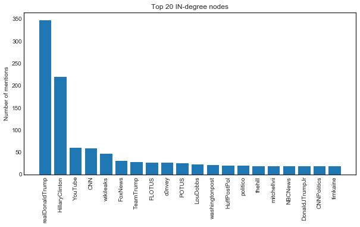


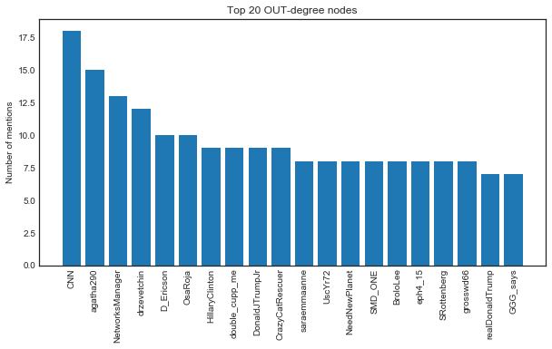


The realDonaldTrump account is by far the most mentioned in the network, followed by HillaryClinton. CNN was the top content producer, having mentioned or retweeted 18 other users.

### Betweeness centrality

One of the most interesting metrics in our analyis is *betweenness centrality*. It is **the measure of how many times a node is part of the path between two other nodes.** Nodes with high betweenness may be influential because of their capacity to control information passing between others. They are also the ones whose removal from the network will most disrupt communications.

*Mathematically, let $n_{s,t}^{i}$ be the number of paths from $s$ to $t$ that pass through $i$ and let $n_{s,t}$ be the total number of paths from $s$ to $t$. Recall that a path is not necessarily unique and the paths between a pair of nodes need not be node-independent, meaning they may pass through some of the same nodes. Then the betweenness centrality of node $i$ is:*

$\displaystyle{b_i = \sum_{s, t} w_{s,t}^{i} = \sum_{s, t} \frac{n_{s,t}^{i}}{n_{s,t}}}$

*where by convention the ratio $w_{s,t}^{i} = 0$ if $n_{s,t} = 0$. Notice that each pair of nodes $s, t$ contribute to the sum for $i$ with a weight $w_{s,t}^{i}$ between 0 and 1 expressing the betweenness of $i$ with respect to the pair $s, t$.*
    
source: https://www.sci.unich.it/~francesc/teaching/network/betweeness.html


```python
betweeness = sorted(nx.betweenness_centrality(G).items(), key=itemgetter(1), reverse=True)[:20]

fig = plt.figure()
fig.set_figheight(5)
fig.set_figwidth(10) 

top_betweeness = [i[0] for i in betweeness]
BC = [i[1] for i in betweeness]
y_pos = np.arange(len(BC))

plt.bar(y_pos, BC)
plt.xticks(y_pos, top_betweeness, rotation='vertical')

plt.ylabel('Number of mentions')
plt.title('Top 20 Betweenness Centrality Scores')
plt.show()
```


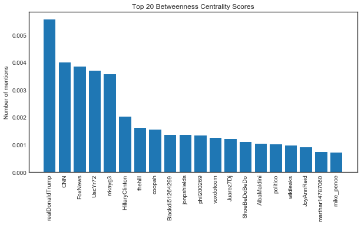


### Clustering coefficient

The **global clustering coefficient** is a measure of how tightly knit a network is. The local clustering coefficient of a node describes the probability that any two nodes it is linked to will also be linked to each other. The higher the clustering score, the more redundant the node.

The clustering coefficient for a node $i$ with $k$ links (degree $k_i$) can be calculated as:

$C_i= \frac{2L_i}{k_i(k_i-1)}$

Where $L_i$ is the number of links between the $k$ neighbors of node $i$. $C_i$ ranges from 0 to 1 and indicates the probability that any two neighbors of node $i$ will be linked to one another.

Another way to refer to clustering is local density. The more connected a network's nodes, the easier it is for information to flow without disruptions. The information flowing through dense networks is harder to be controlled (or censored).


```python
# Converting to an undirected graph
UG = G.to_undirected()

# clustering measures how often nodes share links
clustering = list(nx.clustering(UG).values())
plt.hist(clustering)
plt.title('Histogram - frequency of the clustering coefficients of all nodes')
plt.show()

print('Average network clustering coefficient:', nx.average_clustering(UG))
```


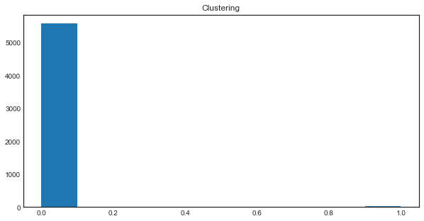


    Average network clustering coefficient: 0.006387539183870326


The clustering coefficient is extremely low, indicating that most of the information was exchanged by individual pairs of nodes. Again, this is not surprising, considering that our tweets were collected in just 3 minutes and 40 seconds.

Let's look at the local clustering coefficient of the top 20 nodes with the highest degree scores, and compare them with the two presidential candidates.


```python
top_20_degrees = sorted(dict(G.degree()).items(), key=itemgetter(1), reverse=True)[:20]

top_nodes = [i[0] for i in top_20_degrees]

top_nodes_avg_clustering = {}

for i in UG:
    neighbors = list(nx.all_neighbors(UG, i))
    top_nodes_avg_clustering[i] = nx.average_clustering(UG, nodes=neighbors)

names = [i[0] for i in sorted(top_nodes_avg_clustering.items(),
                              key=itemgetter(1), reverse=True)[:20]]

avg_clustering = [i[1] for i in sorted(top_nodes_avg_clustering.items(),
                                       key=itemgetter(1), reverse=True)[:20]]

names.extend(['realDonaldTrump', 'HillaryClinton'])

avg_clustering.extend(
    [top_nodes_avg_clustering['realDonaldTrump'], 
     top_nodes_avg_clustering['HillaryClinton']])
```


```python
order = [i for i in range(len(names))]

fig = plt.figure()
fig.set_figheight(5)
fig.set_figwidth(10) 

plt.bar(order, avg_clustering)
plt.xticks(order, names, rotation='vertical')
plt.ylabel('Average Clustering Coefficient')
plt.title('Average Clustering Coefficient of Top 20 Nodes + Trump and Hillary')
plt.show()
```


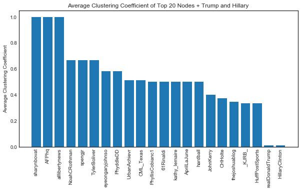


The realDonaldTrump and HillaryClinton accounts have much lower local clustering coefficients than the other accounts. That's because both have very high in-degree scores (they are very frequently mentioned by other users), both accounts rarely mentioned or retweeted other users.

### Shortest path

In our final analysis, we'll visualize the entire network graph and trace the shortest path between the @realDonaldTrump and @POTUS accounts.

POTUS is an acronym for "President of the United States". The account is managed by the White House.


```python
shortest = nx.shortest_path(G, source='realDonaldTrump', target='POTUS')

edges, weights = zip(*nx.get_edge_attributes(G,'weight').items())

colors = tuple(nx.get_edge_attributes(G,'color').values())

degrees = dict(nx.degree(G))

fig = plt.figure()
fig.set_figheight(300)
fig.set_figwidth(300) 

fig.suptitle('Shortest Path from realDonaldTrump to POTUS',fontsize=400)

pos=nx.spring_layout(G)
nx.draw_networkx(G,
                 pos, # Positions the nodes relative to each other
                 with_labels=False,
                 arrows=False,
                 node_size=[(v*1000) for v in degrees.values()],
                 cmap=plt.cm.hot, # The color palette to use to color the nodes
                 node_color=colors, # The number of shades of color to use
                 edgelist=edges,
                 #edge_cmap=plt.cm.hot,
                 edge_color='#C6DEFF',
                 alpha=.7,
                 width=.00005, # Edge width
                 )

path_edges = list(zip(shortest,shortest[1:]))

nx.draw_networkx_nodes(G,
                       pos,
                       with_labels=True,
                       node_size=[(v*1000) for v in degrees.values()],
                       nodelist=shortest,
                       node_color='#B22222',
                       font_size=100)

nx.draw_networkx_edges(G,
                       pos,
                       with_labels=True,
                       edgelist=path_edges,
                       edge_color='#B22222',
                       width=15,
                       font_size=100)


plt.axis('off')
fig.savefig('all_tweets_path.pdf')
```


# Conclusion
